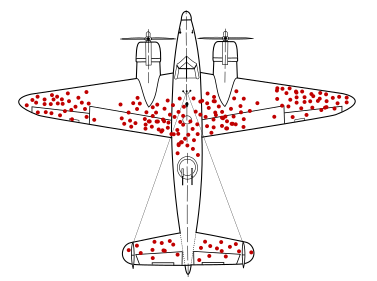
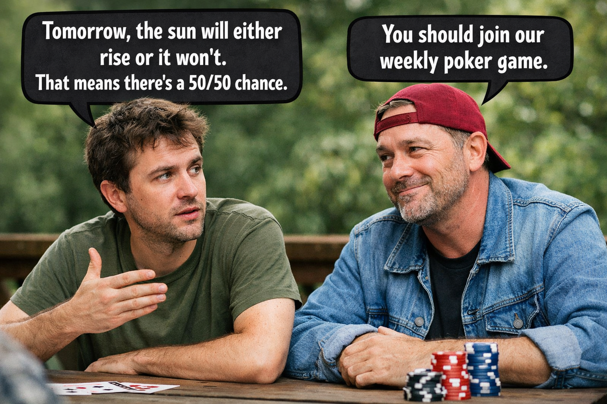
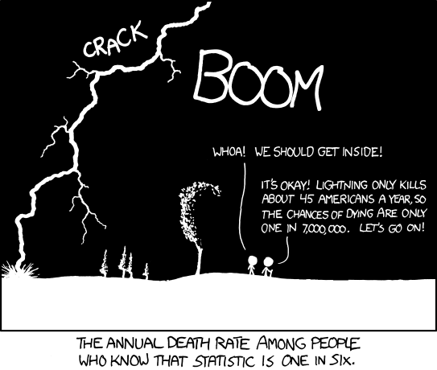

---
format:
  revealjs:
    self-contained: false
    include-in-header:
      - text: |
          <script src="js/dagitty.js"></script>
          <script src="js/graph.js" type="module"></script>
          <script src="https://cdn.jsdelivr.net/npm/jspreadsheet-ce@5/dist/index.js"></script>
          <link rel="stylesheet" href="https://cdn.jsdelivr.net/npm/jspreadsheet-ce@5/dist/jspreadsheet.css">
          <script src="https://cdn.jsdelivr.net/npm/jsuites@5/dist/jsuites.js"></script>
          <link rel="stylesheet" href="https://cdn.jsdelivr.net/npm/jsuites@5/dist/jsuites.css">
---


# Removed slides {.center}

Slides cut from the main decks, kept here for reference and possible reuse.

# From Week 2 (cut 2026-10-03) {.center}

Bayes theorem, priors/posteriors and likelihood: now covered by Week 1.

# Airplanes return from battle
<!-- TODO: turn this into an animation of some sort -->
:::{.r-stack}
{width="80%" style="text-align:center;"}
:::

# Goals this week
- Get more specific about "beliefs"
  - Concept: Parameters
  - Concept: Probability Distributions
- Learn how to use Bayes Theorem
  - Concept: Priors and posteriors
  - Concept: Likelihood
- Design a real analysis


# Parameters: What is a "belief"?

- Beliefs _about what?_
  - "parameters": unknown numerical quantities in the world
  - "estimand": what we want to find out (often a parameter)

- Refined Definition:
  - P(belief): P(belief about the possible values of a parameter)
  - Shorthand: P(params) or P(Θ)


# Parameters: Examples

A parameter is a numerical fact about the world that we don't know (but want to find out)

- The average height of adults in Pokhara
- The number of cars driven in Kathmandu on a typical Saturday
- The average exam results in a particular school
- The difference between men's and women's salaries
- The effect of socioeconomic status on college admissions
- The effect of education level on moral judgments


# Practical: Who will win the election?
- Last election: the current candidate got 60% of the votes.
- We have the resources to conduct a survey.
- (Many non-statistical problems to solve when we design a survey.)
- What do we need to provide a meaningful statistical answer?

# Practical: Bayes Theorem

$$
\color{green}{P(\text{belief} \mid \text{data})}
=
\frac{
\color{#1b91ff}{P(\text{data} \mid \text{belief})}
\;\color{#ff2c2d}{P(\text{belief})}
}{
\color{#999}{P(\text{data})}
}
$$

:::{.nonincremental}
- [**P(belief)**]{.red}: prior 
- [**P(belief | data)**]{.green}: posterior
- [**P(data | belief)**]{.blue}: likelihood
- [**P(data)**]{.gray}: marginal likelihood (not interesting)
:::

prior ⨉ likelihood → posterior


# Priors and Posteriors: Updating
P(belief) → P(belief | data)

::: {.columns}

::: {.column}
::: {.r-stack}
::: {.fragment}
```{r}
curve(
  dnorm(x, mean = 60, sd = 10),
  from = 0,
  to = 100,
  ylim = c(0, 0.1),
  col = "red",
  xlab = "",
  lwd = 2,
  ylab = ""
)
legend(
  "topright",
  legend = c("Prior", "Posterior"),
  col = c("red", "blue"),
  lwd = 2
)
```
:::
::: {.fragment}
```{r}
# plot(y ~ rnorm(0, 1))
curve(
  dnorm(x, mean = 60, sd = 10),
  from = 0,
  to = 100,
  ylim = c(0, 0.1),
  col = "red",
  lwd = 2,
  xlab = "",
  ylab = ""
)
curve(
  dnorm(x, mean = 40, sd = 10),
  from = 0,
  to = 100,
  col = "blue",
  lwd = 2,
  add = TRUE
)
legend(
  "topright",
  legend = c("Prior", "Posterior"),
  col = c("red", "blue"),
  lwd = 2
)
```
:::
:::
:::

::: {.column}
::: {.r-stack}
::: {.fragment}
```{r}
curve(
  dnorm(x, mean = 40, sd = 10),
  from = 0,
  to = 100,
  ylim = c(0, 0.1),
  col = "red",
  xlab = "",
  ylab = "",
  lwd = 2
)
legend(
  "topright",
  legend = c("Prior", "Posterior"),
  col = c("red", "blue"),
  lwd = 2
)
```
:::
::: {.fragment}
```{r}
# plot(y ~ rnorm(0, 1))
curve(
  dnorm(x, mean = 40, sd = 10),
  from = 0,
  to = 100,
  ylim = c(0, 0.1),
  col = "red",
  lwd = 2,
  xlab = "",
  ylab = ""
)
curve(
  dnorm(x, mean = 40, sd = 5),
  from = 0,
  to = 100,
  col = "blue",
  lwd = 2,
  add = TRUE
)
legend(
  "topright",
  legend = c("Prior", "Posterior"),
  col = c("red", "blue"),
  lwd = 2
)
```
:::
:::
:::
:::


::: {.columns}
::: {.column}
::: {.r-stack}
::: {.fragment}
```{r}
curve(
  dnorm(x, mean = 40, sd = 5),
  from = 0,
  to = 100,
  ylim = c(0, 0.1),
  col = "red",
  lwd = 2,
  xlab = "",
  ylab = ""
)
legend(
  "topright",
  legend = c("Prior", "Posterior"),
  col = c("red", "blue"),
  lwd = 2
)
```
:::
::: {.fragment}
```{r}
# plot(y ~ rnorm(0, 1))
curve(
  dnorm(x, mean = 40, sd = 5),
  from = 0,
  to = 100,
  ylim = c(0, 0.1),
  col = "red",
  lwd = 2,
  xlab = "",
  ylab = ""
)
curve(
  dnorm(x, mean = 35, sd = 4),
  from = 0,
  to = 100,
  col = "blue",
  lwd = 2,
  add = TRUE
)
legend(
  "topright",
  legend = c("Prior", "Posterior"),
  col = c("red", "blue"),
  lwd = 2
)
```
:::
:::
:::

::: {.column}
::: {.r-stack}
::: {.fragment}
```{r}
curve(
  dnorm(x, mean = 35, sd = 4),
  from = 0,
  to = 100,
  ylim = c(0, 0.1),
  col = "red",
  lwd = 2,
  xlab = "",
  ylab = ""
)
legend(
  "topright",
  legend = c("Prior", "Posterior"),
  col = c("red", "blue"),
  lwd = 2
)
```
:::
::: {.fragment}
```{r}
# plot(y ~ rnorm(0, 1))
curve(
  dnorm(x, mean = 35, sd = 4),
  from = 0,
  to = 100,
  ylim = c(0, 0.1),
  col = "red",
  lwd = 2,
  xlab = "",
  ylab = ""
)
curve(
  dnorm(x, mean = 50, sd = 10),
  from = 0,
  to = 100,
  col = "blue",
  lwd = 2,
  add = TRUE
)
legend(
  "topright",
  legend = c("Prior", "Posterior"),
  col = c("red", "blue"),
  lwd = 2
)
```
:::
:::
:::
:::


# Priors and Posteriors: DIY Prior

<style>
  .prior-layout{
    display: flex;
    gap: 16px;
    align-items: flex-start;
    width: 100%;
  }
  #graph-wrapper{
    flex: 0 0 70%;
    aspect-ratio: 3/2;
  }
  #sheet-wrapper{
    flex: 1 1 auto;
    min-width: 260px;
    font-size: 16pt;
  }
  .sheet-controls{
    margin-top: 8px;
    text-align: right;
  }
  #sheet-reset{
    font-size: 12pt;
    padding: 6px 10px;
  }
  .jss_about {
    display: none;
  }
  .jss_textarea{
    position: absolute !important;
    left: -10000px !important;
    top: 0 !important;
    width: 1px !important;
    height: 1px !important;
    opacity: 0 !important;
    pointer-events: none !important;
  }
</style>

```{=html}
<div class="prior-layout">
  <div id="graph-wrapper"></div>
  <div>
    <div id="sheet-wrapper"></div>
    <div class="sheet-controls">
      <button id="sheet-reset" type="button">Reset</button>
    </div>
  </div>
</div>
```

<script type="module">
  import { LineGraphWidget } from './js/graph.js';

  const graphEl = document.getElementById('graph-wrapper');
  const sheetEl = document.getElementById('sheet-wrapper');
  const resetBtn = document.getElementById('sheet-reset');
  const STORAGE_KEY = 'diy-prior-values-v1';

  if (!graphEl || !sheetEl) {
    console.warn('DIY Prior: missing graph or sheet container.');
  } else if (!graphEl.dataset.initialized) {
    graphEl.dataset.initialized = 'true';

    let widget = null;
    let ws = null;

    function loadStoredValues() {
      try {
        const raw = localStorage.getItem(STORAGE_KEY);
        if (!raw) return null;
        const parsed = JSON.parse(raw);
        if (!Array.isArray(parsed)) return null;
        return parsed.map((v) => Number(v));
      } catch {
        return null;
      }
    }

    function saveStoredValues(values) {
      try {
        localStorage.setItem(STORAGE_KEY, JSON.stringify(values));
      } catch {
        // ignore storage errors
      }
    }

    function pointsToTable(points) {
      const ys = points.map(p => Number(p.y) || 0);
      const sum = ys.reduce((a, b) => a + b, 0);
      return ys.map((v,i) => [i*0.05, v, sum > 0 ? v / sum : 0]);
    }

    function getWorksheetHandle(obj) {
      if (!obj) return null;

      if (typeof obj.setData === 'function' ||
          typeof obj.loadData === 'function' ||
          typeof obj.setValueFromCoords === 'function' ||
          typeof obj.setValue === 'function') {
        return obj;
      }

      if (Array.isArray(obj)) return getWorksheetHandle(obj[0]);
      if (Array.isArray(obj.worksheets)) return getWorksheetHandle(obj.worksheets[0]);
      if (typeof obj.getWorksheet === 'function') return getWorksheetHandle(obj.getWorksheet(0));

      return null;
    }

    function updateSheet(points) {
      if (!ws) return;
      const data = pointsToTable(points);

      if (typeof ws.setData === 'function') {
        ws.setData(data);
        return;
      }
      if (typeof ws.loadData === 'function') {
        ws.loadData(data, true);
        return;
      }
      if (typeof ws.setValueFromCoords === 'function') {
        for (let r = 0; r < 21; r++) {
          ws.setValueFromCoords(0, r, data[r][0], true);
          ws.setValueFromCoords(1, r, data[r][1], true);
        }
        return;
      }
      if (typeof ws.setValue === 'function') {
        for (let r = 0; r < 21; r++) {
          ws.setValue(`A${r + 1}`, data[r][0], true);
          ws.setValue(`B${r + 1}`, data[r][1], true);
        }
      }
    }

    function ensureReadyThenInit() {
      const rect = graphEl.getBoundingClientRect();
      const visible = rect.width > 0 && rect.height > 0;
      if (!visible) return false;

      if (window.Reveal?.getCurrentSlide) {
        const cur = window.Reveal.getCurrentSlide();
        if (!cur?.querySelector('#graph-wrapper')) return false;
      }

      if (!widget) {
        graphEl.innerHTML = '';
        sheetEl.innerHTML = '';

        const stored = loadStoredValues();
        const initialValues = Array.isArray(stored) && stored.length === 21
          ? stored
          : Array.from({ length: 21 }, () => 50);

        widget = new LineGraphWidget({
          container: graphEl,
          yValues: initialValues,
          onChange: (points) => {
            updateSheet(points);
            saveStoredValues(points.map((p) => p.y));
          },
        });

        const initData = pointsToTable(widget.getPoints());
        const created = window.jspreadsheet(sheetEl, {
          tabs: false,
          worksheets: [{
            data: initData,
            editable: false,
            minDimensions: [2, 21],
            rowHeaders: (rowIndex) => (rowIndex * 0.05).toFixed(2),
            allowInsertRow: false,
            allowDeleteRow: false,
            allowInsertColumn: false,
            allowDeleteColumn: false,
            columnSorting: false,
            columns: [
              { type: 'numeric', title: 'Voters', width: 90, mask: '0%' },
              { type: 'numeric', title: 'Score', width: 90, mask:'0.00' },
              { type: 'numeric', title: 'Probability', width: 120, mask: '0.0000' },
            ],
            selectionCopy: true,   // enables copying selected range
            selection: true,       // ensures range selection is on (harmless if default)
          }],
        });

        Promise.resolve(created).then((spreadsheet) => {
          ws = getWorksheetHandle(spreadsheet);
          if (!ws) {
            console.log('jspreadsheet return value:', spreadsheet);
            throw new Error('Could not find a worksheet handle. See console log for returned object.');
          }
          updateSheet(widget.getPoints());
        });

        if (resetBtn) {
          resetBtn.addEventListener('click', () => {
            const resetValues = Array.from({ length: 21 }, () => 50);
            widget.setYValues(resetValues);
            saveStoredValues(resetValues);
          });
        }
      }

      return true;
    }

    const observer = new ResizeObserver(() => {
      if (ensureReadyThenInit()) observer.disconnect();
    });
    observer.observe(graphEl);

    const runWhenReady = () => {
      if (!ensureReadyThenInit()) requestAnimationFrame(runWhenReady);
    };

    if (window.Reveal?.on) {
      Reveal.on('ready', runWhenReady);
      Reveal.on('slidechanged', runWhenReady);
    } else {
      window.addEventListener('load', runWhenReady);
      runWhenReady();
    }
  }
</script>


# Likelihood: Probability in the World
:::{.r-stack}

:::{.fragment .fade-in-then-out}
{width="900px"}
:::

:::{.fragment}
{width="900px"}
:::

:::

::: {.fragment}
Probability isn't just in our heads. Sometimes, it's generated by a process in the world.
:::


# Likelihood: Building Models
- From Bayes theorem, we know that likelihood is: P( data | parameters )
- But what does this mean?

::: {.fragment .callout-tip}
## Instead of starting with our beliefs, likelihood starts with what we *saw*.
We surveyed 15 people and 4 said that they will vote for the current mayor.
:::

- Now, we need to ask, "How consistent is this observation with different possible values of our parameter?"
- Given a particular parameter value, how likely is the data we saw?
  - If our parameter is _actually_ 50%, what are the chances of seeing 4 out of 15?
  - If our parameter is _actually_ 30%, what are the chances of seeing 4 out of 15?
  - If our parameter is _actually_ 80%, what are the chances of seeing 4 out of 15?

::: {.fragment}
These are questions that any calculator can answer.
:::

# Likelihood: So what it is
<!-- TODO: Expand this to include a better comparison -->
- For priors and posteriors, randomness is about our uncertainty (a subjective experience).
- For likelihood, randomness is generated by specific processes in the world.
- Our job is to describe how patterns of variation (including randomness) occur.

# Grid approximation worksheet
<!-- TODO: Implement worksheet -->

<div id="sheet1" style="width:100%; font-size: 14pt;"></div>

<script>
(() => {
  const el = document.getElementById("sheet1");

  const rows = 21, cols = 8;
  const data = Array.from({ length: rows }, () => Array(cols).fill(0));

  const columns = Array.from({ length: cols }, (_, i) => ({
    type: "numeric",
    title: `Col ${i + 1}`,
    width: 150
  }));

  // Newer API: worksheets is required
  window.sheet1 = jspreadsheet(el, {
    plugins: [
      // clipboard plugin is typically exposed as `jspreadsheet.plugins.clipboard`
      // jspreadsheet.plugins.clipboard
    ],
    worksheets: [{
      data,
      columns,
      minDimensions: [cols, rows]
    }],
    tableOverflow: true,
    tableWidth: "100%",
    tableHeight: "420px"
  });
})();
</script>

# From Week 3 (cut 2026-10-03) {.center}

Priors, likelihood and model-writing slides (now covered by Weeks 1–2), the original
weight models and the World Bank fertility walkthrough. The R code is kept for reference
but not run (`eval = FALSE`).

```{r week3-archive-setup, include=FALSE}
knitr::opts_chunk$set(eval = FALSE)
```

# Models impose order on randomness

```{=html}
<iframe
  id="dag-frame-1"
  data-external="1"
  style="width:100%; aspect-ratio: 2 / 1; border:1px solid black;"
  src="https://dagitty.net/dags.html"
></iframe>
<!-- <iframe
  id="dag-frame-1"
  data-external="1"
  style="width:100%; aspect-ratio: 2 / 1; border:1px solid black;"
  src="js/dag-embed.html"></iframe> -->

<!-- <script>
(() => {
  const dag = `dag {
    Admitted [outcome,pos="-0.619,0.077"]
    Department [exposure,pos="-0.858,0.192"]
    Sex [exposure,pos="-1.059,-0.272"]
    UNKNOWN [latent,pos="-0.414,0.077"]
    Department -> Admitted  
    Sex -> Admitted
    Sex -> Department
    UNKNOWN -> Admitted
  }`;

  const frame = document.getElementById("dag-frame-1");

  function send() {
    if (!frame?.contentWindow) return;
    frame.contentWindow.postMessage({ type: "dagitty", dag }, "*");
  }

  frame.addEventListener("load", send);

  // Optional: re-send when returning to the slide (Reveal may not exist in non-reveal contexts)
  window.addEventListener("load", () => {
    if (window.Reveal?.on) {
      Reveal.on("ready", send);
      Reveal.on("slidechanged", (e) => {
        if (e.currentSlide?.querySelector("#dag-frame-1")) send();
      });
    }
  });
})();
</script> -->
```


# What have we done so far?
- We chose a parameter.
- We stated our *prior* belief.
- We made observations.
- We calculated the *likelihood* of the things we observed.
- We combined our prior and likelihood to produce an updated *posterior* belief.

# Goals for this week
- Concept: models
- Model definition language
- Explore two types of models:
  - Parameter estimates
  - Regressions


# What is a model?

- Our **data** is the observation we made [(# of Surveys, # of Votes)]{.fragment .green}
- Our **model** is a theoretical description of how this data was generated, combining:
  - Our *prior* belief about our parameter(s) [(Popularity)]{.fragment .blue}
  - A method of calculating our *likelihood* from data

<!-- # What is "fitting"?

- We "fit" our model to our data using Bayes' Theorem.
- This updates our prior -> posterior.
- We can use different techniques for this process:
  - Stones in a bag: we counted all possibilities
  - Election polling: we used "grid approximation" to estimate the parameter every 5%
  - Going forward: we'll use software (Markov Chain Montey Carlo, or MCMC)
 -->


# Writing Priors
We need a way to *describe* our prior belief for all values of our parameter (Popularity)

::: {.columns}

::: {.column width="33%"}
::: {.fragment}

```{r prior1, echo=FALSE, warning=FALSE, message=FALSE}
x <- seq(0, 100, length.out = 1001)
y <- dunif(x, min = 0, max = 100)

plot(
  x,
  y,
  type = "l",
  lwd = 2,
  col = "red",
  xlim = c(0, 100),
  xlab = "Votes",
  ylab = "Density",
  main = "Popularity ~ Uniform(0,100)",
  cex.main = 3
)
```

:::

::: {.fragment}

```{r prior2, echo=FALSE, warning=FALSE, message=FALSE}
x <- seq(0, 100, length.out = 1001)
y <- dunif(x, min = 20, max = 80)

plot(
  x,
  y,
  type = "l",
  lwd = 2,
  col = "red",
  xlim = c(0, 100),
  xlab = "Votes",
  ylab = "Density",
  main = "Popularity ~ Uniform(20,80)",
  cex.main = 3
)
```

:::
:::

::: {.column width="33%"}
::: {.fragment}

```{r prior3, echo=FALSE, warning=FALSE, message=FALSE}
x <- seq(0, 100, length.out = 1001)
y <- dnorm(x, mean = 50, sd = 20)

plot(
  x,
  y,
  type = "l",
  lwd = 2,
  col = "red",
  xlim = c(0, 100),
  xlab = "Votes",
  ylab = "Density",
  main = "Popularity ~ Normal(50,20)",
  cex.main = 3
)
```

:::

::: {.fragment}

```{r prior4, echo=FALSE, warning=FALSE, message=FALSE}
x <- seq(0, 100, length.out = 1001)
y <- dnorm(x, mean = 40, sd = 5)

plot(
  x,
  y,
  type = "l",
  lwd = 2,
  col = "red",
  xlim = c(0, 100),
  xlab = "Votes",
  ylab = "Density",
  main = "Popularity ~ Normal(40,5)",
  cex.main = 3
)
```

:::
:::

::: {.column width="33%"}
::: {.fragment}

```{r prior5, echo=FALSE, warning=FALSE, message=FALSE}
x <- seq(0, 100, length.out = 1001)
y <- dnorm(x, mean = 60, sd = 15)
plot(
  x,
  y,
  type = "l",
  lwd = 2,
  col = "red",
  xlim = c(0, 100),
  xlab = "Votes",
  ylab = "Density",
  main = "Popularity ~ Normal(60,15)",
  cex.main = 3
)
```

:::

::: {.fragment}

```{r prior6, echo=FALSE, warning=FALSE, message=FALSE}
x <- seq(0, 100, length.out = 1001)
y <- dnorm(x, mean = 80, sd = 3)

plot(
  x,
  y,
  type = "l",
  lwd = 2,
  col = "red",
  xlim = c(0, 100),
  xlab = "Votes",
  ylab = "Density",
  main = "Popularity ~ Normal(80,3)",
  cex.main = 3
)
```

:::
:::

:::

# Distributions Demo {.no-title}

```{shinylive-r}
#| standalone: true

``` 


# Writing likelihood functions

We need a way to describe how our data got made, linking our parameter (Popularity) to our observed data (Surveys and Votes)

$$
{\color{green}{Votes}} \sim \mathrm{Binomial}({\color{green}{Surveys}}, {\color{blue}{Popularity}})
$$

[Observed Data]{.green}

[Parameter(s)]{.blue}

# Writing complete models

$$
\begin{align}
\color{green}{Votes} &\sim \color{green}{\mathrm{Binomial}(Surveys, Popularity)} \\
\color{red}{Popularity} &\sim \color{red}{\mathrm{Normal}(60\%, 15\%)}
\end{align}
$$

[Likelihood function]{.green}

[Prior Belief]{.red}

<!-- # Two major types of models:

- Understanding the distribution of variables (parameter estimation)
  - Based on limited survey data, who do we think will win an election?
  - Based on social network analysis, how many Nepali citizens currently live abroad?

- Understanding relationships between variables (regression)
  - Does yoga lead to longer, healthier lives?
  - Does education make people happy?
  - What interventions can change national birth rates? -->


<!-- # Cause is super weird
- it's always a theoretical attribution, simplifying arbitrary complexity
- in the social science, we tend to think about cause as sites of intervention -->

# Modeling individual weight

```{r weight, echo=FALSE, warning=FALSE, message=FALSE}
df_weight <- read_csv("datasets/kungsan.csv") |>
  filter(age >= 18) |>
  mutate(
    height_std = scale(height) |> as.numeric(),
    age_std = scale(age) |> as.numeric(),
    sex = ifelse((male == 0), "female", "male") |> as_factor()
  )

ggplot(df_weight, aes(x=weight)) +
  geom_histogram(bins=32, color="gray") + 
  geom_vline(
    xintercept = mean(df_weight$weight),
    color = "red",
    linetype = "dashed"
  )
```


# Model definition (Weight)

$$
\begin{align}
\text{weight}_i &\sim \text{Normal}(\mu, \sigma) \\
\mu &\sim \text{Normal}(50, 10) \\
\sigma &\sim \text{Normal}(0, 10), \quad \sigma > 0
\end{align}
$$

```{r model_weight1, message=FALSE, results="hide"}
model_weight1 <- cmdstan_model("models/weight1.stan", dir=".stancache")
fit_weight1 <- df_weight |>
  compose_data() |>
  model_weight1$sample()
```
```{r summary_weight1}
fit_weight1$summary()
```


# Vertical plot 
```{r weight_vert, echo=FALSE, warning=FALSE, message=FALSE}
ggplot(df_weight) +
  geom_jitter(
    data = df_weight,
    aes(x = 0, y = weight, color=sex),
    shape = "cross",
    color = "purple"
  ) +
  geom_hline(
    yintercept = mean(df_weight$weight),
    color = "red",
    linetype = "dashed"
  ) +
  xlim(-2, 2)
```

# Vertical plot (sex differentiated)

```{r weight_sex, echo=FALSE, warning=FALSE, message=FALSE}
ggplot(df_weight) +
  geom_jitter(
    data = df_weight,
    aes(x = ifelse(sex == "male", -1, 1), y = weight, color=sex),
    shape = "cross",
  ) +
  geom_hline(
    yintercept = mean((df_weight |> filter(sex == "male"))$weight),
    color = "red",
    linetype = "dashed"
  ) +
  geom_hline(
    yintercept = mean((df_weight |> filter(sex == "female"))$weight),
    color = "blue",
    linetype = "dashed"
  ) +
  xlim(-2, 2)
```


# Model (Weight ~ Sex)
$$
\begin{align}
\text{weight}_i &\sim \text{Normal}(\mu_i, \sigma) \\
\mu_i &= \alpha_{\text{sex}[i]} \\
\alpha_j &\sim \text{Normal}(50, 10) \\
\sigma &\sim \text{Normal}(0, 10), \quad \sigma > 0
\end{align}
$$

```{r model_weight2, message=FALSE, results="hide"}
model_weight2 <- cmdstan_model("models/weight2.stan", dir=".stancache")
fit_weight2 <- df_weight |>
  compose_data() |>
  model_weight2$sample()
```

```{r summary_weight2}
fit_weight2$summary() |>
  replace_indexes(df_weight, alpha[sex])
```


# Scatter plot (with height)

:::{.r-stack width="1605"}
:::{.fragment width="1605"}
```{r weight_height1, echo=FALSE, warning=FALSE, message=FALSE, out.width="1605"}
df_weight |>
  ggplot(aes(x = height, y = weight)) +
  geom_point(color = "purple", shape = "plus") +
  labs(x = "Height (cm)", y = "Weight (kg)")

```
:::

:::{.fragment width="1605"}
```{r weight_height2, echo=FALSE, warning=FALSE, message=FALSE, out.width="1605"}
df_weight |>
  ggplot(aes(x = height, y = weight)) +
  geom_point(color = "purple", shape = "plus") +
  geom_smooth(method="lm", se=FALSE) +
  labs(x = "Height (cm)", y = "Weight (kg)")

```
:::

:::{.fragment width="1605"}
```{r weight_height3, echo=FALSE, warning=FALSE, message=FALSE, out.width="1605"}
df_weight |>
  ggplot(aes(x = height / 2.56, y = weight)) +
  geom_point(color = "purple", shape = "plus") +
  geom_smooth(method="lm", se=FALSE) +
  labs(x = "Height (inches)", y = "Weight (kg)")

```
:::

:::{.fragment width="1605"}
```{r weight_height4, echo=FALSE, warning=FALSE, message=FALSE, out.width="1605"}
df_weight |>
  ggplot(aes(x = scale(height), y = weight)) +
  geom_point(color = "purple", shape = "plus") +
  geom_smooth(method="lm", se=FALSE) +
  labs(x = "Height (standardized)", y = "Weight (kg)")

```
:::

:::

# Model (Weight ~ Height)

$$
\begin{align}
\text{weight}_i &\sim \text{Normal}(\mu_i, \sigma) \\
\mu_i &= \alpha + \beta\times \text{height}_i \\
\alpha &\sim \text{Normal}(50, 10) \\
\beta &\sim \text{Normal}(0, 10) \\
\sigma &\sim \text{Normal}(0, 10), \quad \sigma > 0
\end{align}
$$

```{r model_weight3, message=FALSE, results="hide"}
model_weight3 <- cmdstan_model("models/weight3.stan", dir=".stancache")
fit_weight3 <- df_weight |>
  compose_data() |>
  model_weight3$sample()
```
```{r summary_weight3}
fit_weight3$summary()
```

# Models tell stories

```{=html}
<iframe
  id="dag-frame-1"
  data-external="1"
  style="width:100%; aspect-ratio: 2 / 1; border:1px solid black;"
  src="https://dagitty.net/dags.html"
></iframe>
```


# Model (Weight ~ Sex + Height)

$$
\begin{align}
\text{weight}_i &\sim \text{Normal}(\mu_i, \sigma) \\
\mu_i &= \alpha_{\text{sex}[i]} + \beta\times \text{height}_i \\
\alpha_j &\sim \text{Normal}(50, 10) \\
\beta &\sim \text{Normal}(0, 10) \\
\sigma &\sim \text{Normal}(0, 10), \quad \sigma > 0
\end{align}
$$

```{r model_weight4, message=FALSE, results="hide"}
model_weight4 <- cmdstan_model("models/weight4.stan", dir=".stancache")
fit_weight4 <- df_weight |>
  compose_data() |>
  model_weight4$sample()
```
```{r summary_weight4}
fit_weight4$summary() |>
  replace_indexes(df_weight, alpha[sex])
```


# Understanding global birth rates

```{r wb_setup, echo=FALSE, warning=FALSE, message=FALSE}
filename <- "datasets/wb2022.csv"

# build a variable label vector for better labelling of df
label_vec <- read_csv(filename) |>
  distinct(`Series Code`, `Series Name`) |>
  filter(!is.na(`Series Code`), !is.na(`Series Name`)) |>
  group_by(`Series Code`) |> # in case of duplicates
  summarise(label = first(`Series Name`), .groups = "drop") |>
  with(setNames(label, `Series Code`))

# compose dataframe
df <- read_csv(filename) |>
  select(-c(`Series Name`)) |>
  slice(1:(n() - 5)) |>
  pivot_longer(
    cols = matches("^\\d{4} \\[YR\\d{4}\\]$"),
    names_to = "year",
    values_to = "value",
    names_transform = list(year = ~ str_extract(.x, "^\\d{4}"))
  ) |>
  pivot_wider(names_from = `Series Code`, values_from = value) |>
  mutate(across(
    any_of(names(label_vec)),
    ~ {
      attr(.x, "label") <- unname(label_vec[cur_column()])
      .x
    }
  )) |>
  left_join(
    read_csv("datasets/wb_country.csv"),
    join_by(`Country Code` == Code)
  )

# build variable summary showing only eligible variables
label_df <- df |>
  summarise(across(everything(), ~ sum(is.na(.x)))) |>
  pivot_longer(everything(), names_to = "column", values_to = "n_NA") |>
  # filter(n_NA < 50) |>
  rowwise() |>
  filter(
    !any(is.na(df[df$`Country Name` == "Nepal", .data$column, drop = TRUE]))
  ) |>
  ungroup() |>
  transmute(
    `Series Code` = column,
    label = unname(label_vec[column])
  ) |>
  filter(!is.na(label))
```

:::{.r-stack }

:::{.fragment width="1605"}
```{r wb_fertility1, echo=FALSE, warning=FALSE, message=FALSE, out.width="1605"}
ggplot(df, aes(x = SP.DYN.TFRT.IN)) +
  geom_histogram(bins = 11, colour = "darkgray") +
  scale_fill_discrete(
    labels = scales::label_wrap(20)
  ) +
  theme(legend.key.spacing.y = unit(0.2, 'cm'), legend.key = element_blank())
```


:::

:::{.fragment width="1605"}
```{r wb_fertility2, echo=FALSE, warning=FALSE, message=FALSE, out.width="1605"}
ggplot(df, aes(x = SP.DYN.TFRT.IN, fill = Region)) +
  geom_histogram(bins = 11, colour = "darkgray", position = "stack") +
  scale_fill_discrete(
    labels = scales::label_wrap(20)
  ) +
  theme(legend.key.spacing.y = unit(0.2, 'cm'), legend.key = element_blank())
```
:::


:::


# Birthrate ~ Women's College Enrollment

```{r wb_college, echo=FALSE, warning=FALSE, message=FALSE}
ggplot(df, aes(x = SE.TER.ENRR.FE, y = SP.DYN.TFRT.IN)) +
  geom_point(aes(color = Region)) +
  stat_smooth(method = "lm") +
  scale_color_discrete(
    labels = scales::label_wrap(20)
  ) +
  theme(legend.key.spacing.y = unit(0.2, 'cm'), legend.key = element_blank())
```


# Birthrate ~ Infant Mortality

:::{.r-stack}

:::{.fragment width="1605"}
```{r wb_infant1, echo=FALSE, warning=FALSE, message=FALSE, out.width="1605"}
ggplot(df, aes(x = SP.DYN.IMRT.IN, y = SP.DYN.TFRT.IN)) +
  geom_point(aes(color = Region)) +
  stat_smooth(method = "lm") +
  scale_color_discrete(
    labels = scales::label_wrap(20)
  ) +
  scale_x_continuous(limits = c(0, 100)) +
  theme(legend.key.spacing.y = unit(0.2, 'cm'), legend.key = element_blank())

```

:::

:::{.fragment width="100%"}

```{r wb_infant2, echo=FALSE, warning=FALSE, message=FALSE, out.width="1605"}
ggplot(df, aes(x = log(SP.DYN.IMRT.IN), y = SP.DYN.TFRT.IN)) +
  geom_point(aes(color = Region)) +
  stat_smooth(method = "lm") +
  scale_color_discrete(
    labels = scales::label_wrap(20)
  ) +
  # scale_x_continuous(limits=c(0,100)) +
  theme(legend.key.spacing.y = unit(0.2, 'cm'), legend.key = element_blank())

```

:::
:::

# Data: no meaning without a story

```{=html}
<iframe
  id="dag-frame-1"
  data-external="1"
  style="width:100%; aspect-ratio: 2 / 1; border:1px solid black;"
  src="https://dagitty.net/dags.html"
></iframe>
```


# Model (Fertility ~ Women in College)
```{r model1a, message=FALSE, results="hide"}
model1a <- cmdstan_model("models/fertility1a.stan", dir=".stancache")
fit1a <- df |>
  transmute(
    fertility_rate = SP.DYN.TFRT.IN,
    women_in_college = scale(SE.TER.ENRR.FE) |> as.numeric()
  ) |>
  drop_na() |>
  compose_data() |>
  model1a$sample()
```

```{r model1a_output}
fit1a |>
  spread_draws(alpha, beta, sigma) |>
  ggplot(aes(x = beta)) +
  stat_halfeye()

fit1a$summary()
```


# Model (Fertility ~ Infant Mortality)
```{r model1b, message=FALSE, results="hide"}
model1b <- cmdstan_model("models/fertility1b.stan", dir=".stancache")
fit1b <- df |>
  transmute(
    fertility_rate = SP.DYN.TFRT.IN,
    infant_mortality = scale(SP.DYN.IMRT.IN) |> as.numeric()
  ) |>
  drop_na() |>
  compose_data() |>
  model1b$sample(chains=1)
```

```{r model1b_output}
fit1b |>
  spread_draws(alpha, beta, sigma) |>
  ggplot(aes(x = beta)) +
  stat_halfeye()

fit1b$summary()
```


# Model (Fertility ~ Women in College + Infant Mortality)
```{r model2, message=FALSE, results="hide"}
model2 <- cmdstan_model("models/fertility2.stan", dir=".stancache")
fit2 <- df |>
  transmute(
    fertility_rate = SP.DYN.TFRT.IN,
    women_in_college = scale(SE.TER.ENRR.FE) |> as.numeric(),
    infant_mortality = scale(SP.DYN.IMRT.IN) |> as.numeric()
  ) |>
  drop_na() |>
  compose_data() |>
  model2$sample(chains=1)

```

:::{.columns}
:::{.column}

```{r model2_output1, message=FALSE, results="hide"}
fit2 |>
  spread_draws(alpha, beta_college, beta_mortality, sigma) |>
  ggplot() +
  stat_halfeye(aes(x = beta_college))
```


:::
:::{.column}

```{r model2_output2, message=FALSE, results="hide"}
fit2 |>
  spread_draws(alpha, beta_college, beta_mortality, sigma) |>
  ggplot() +
  stat_halfeye(aes(x = beta_mortality))
```

:::
:::


```{r model2_output3}
fit2$summary()
```