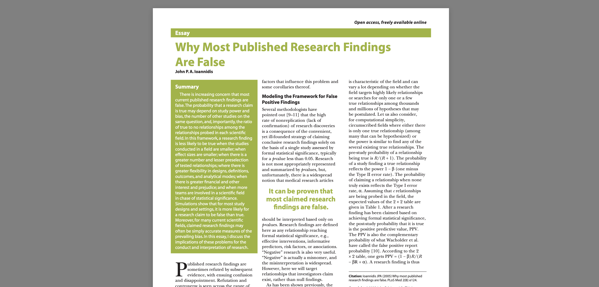
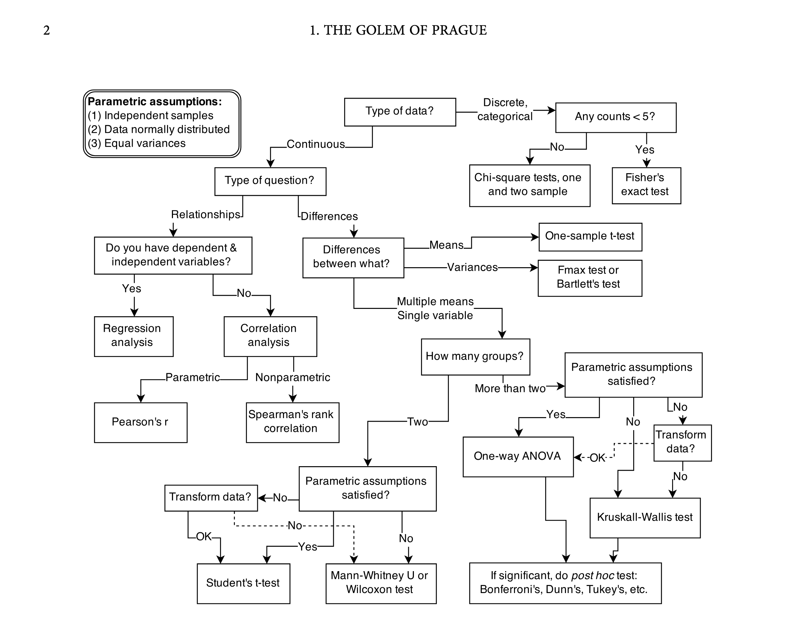

# Data Lunch: Week 1 {.center}

A Fresh Start

::: {.footer}
The Open Institute For Social Science
:::

::: {.notes}
- Statistical backgrounds?
- Goal: ask questions and observe the world
- There is technical material, but it's easy to forget that the technical material is not the point.
:::

# Most published research is false

{width="100%"}
[https://journals.plos.org/plosmedicine/article?id=10.1371/journal.pmed.0020124](https://journals.plos.org/plosmedicine/article?id=10.1371/journal.pmed.0020124)

:::{.fragment}
{.absolute bottom=75 left=0 width="100%"}

<div style="position: absolute; bottom: 100px; left: 940px; font-size: 150%; font-weight: bold;",>
...and that's okay.
</div>
:::

::: {.notes}
- Article by a Greek-American medical scientist at Stanford named John Ioannidis
- purely theoretical argument, based on some very mathy arguments
- Argues that the majority of claims made in published scientific articles are wrong.

- He doesn't state a specific number, but he does say more than half and probably a lot more than half of all findings are false. 
- Others have attempted to test this claim empirically, and sure enough in many fields findings were reproducible as little as 10-20% of the time.

- This was a shocking and controversial claim when it was published in 2006, but today I think there's a consensus that Ioannidis is right.

- But how can he make this argument, purely theoretically? And what do we do with that? In medicine, sociology, economics, psychology, engineering, as much as 80-90 percent of our hard, statistical findings are just wrong.

- I'm here to tell you, it's both true and okay. Most science is wrong, and that's okay. 

- Published research findings may be wrong 80-90% of the time, but science still works. It works really, really well.

- Thats a paradox. 

- It's okay for a very simple reason. Statistics is observation, and observation is always messy. It's only a problem if we expect it to be tidy.

- To make sense of it, we need to understand what statistics is. We need to stop treating statistics as mathmatical rituals and start treating it like a way to reflect on and update our own thinking. Thats the goal of this course.
:::

# This week's goals

:::{.nonincremental}
- Unpack the key concepts underlying Ioannidis's claim.
  - Statistical significance 
  - The base rate paradox
- Start rebuilding statistics from the ground up.
:::

# Statistical significance

::: {.columns}

::: {.column width="80%"}
::: {.fragment fragment-index=1}
> A result is statistically significant if, assuming the null hypothesis is true and the model assumptions hold, the probability of obtaining data at least as extreme as those observed (the p-value) is less than or equal to the chosen significance level α. This leads to rejection of the null hypothesis while controlling the long-run Type I error rate at α. (ChatGPT, 2026)
:::
:::

::: {.column width="20%"}
::: {.fragment fragment-index=2}
{.absolute top=0 right=0 width="15%"}
:::
:::

:::

<ul>
  <li class="fragment" data-fragment-index=2>If this confuses you, you're not alone. It is deeply unintuitive.</li>
  <li class="fragment">We are going to scrap all of this conceptual baggage and start over.</li>
</ul>


::: {.notes}
- This approach goes by a number of different names: frequentist statistics, null hypothesis significance testing, classical statistics, p-value statistics, or just "statistics"
- There's nothing wrong with frequentist approaches. They are valid, capable, convenient and useful.
- The math is 100% valid.
- But it's a terrible way to learn statistics
- The way it thinks about probability is deeply, deeply unintuitive.
:::

# Probability

So what is probability? [It's just a way of talking about uncertainty.]{.fragment}

::: {.fragment}
Two conventions:
:::

- _We express probability as a number between 0 and 1 (0% to 100%)._
- _We write probability as P( event ) or P( event | condition )._

::: {.fragment}
In 2025, Kathmandu saw rain on 179 days:
:::

- P( rain ) = 179 / 365 = 0.49 (49%)

::: {.fragment}
We can do better with _conditional probabilities_:
:::

::: {.fragment .nonincremental}
- P( rain | Apr) = 13/30 (0.43)
- P( rain | Dec) = 0/31 (0.00)
- P( rain | Jul ) = 31/31 (1.00)
- P( rain | Feb ) = 2/28 (0.07)
:::

::: {.notes}
- Imagine asking a friend if it will rain tomorrow. They say, "Probably". What does that word "probably" mean?
- Intuitively, probability is a way of talking about uncertainty.
- To frequentists, it's a way of talking about the long run outcome of repeated measurements. Strange.
- We're going to build statistics using a more intuitive set of concepts.

:::


# Probability Examples

::: {.fragment .nonincremental}
- P( bachelors degree )
- P( bachelors degree | urban )
- P( bachelors degree | rural )
:::

- P( win | leading at halftime)
- P( disease | family history )
- P( rain today | rained yesterday )
- P( survival | attacked by bear )


# Applied probability

::: {.fragment}
In Nepal, HIV has a prevalence of about 0.1%. We can write that as:
:::

- P( HIV+ ) = 0.001 (0.1%)

::: {.fragment}
With statistical tests and predictions, we talk about two kinds of "accuracy":
:::

- **Sensitivity**: probability of a positive result testing a person who has HIV
- **Specificity**: probability of a negative test result testing a person who doesn't have HIV

::: {.fragment .nonincremental}
We can write these using our probability language:

- Sensitivity: P( test+ | HIV+ ) = 0.99 (99%)
- Specificity: P( test– | HIV– ) = 0.97 (97%)
:::

::: {.notes}
One common use of statistics is to evaluate the accuracy of predictive tests.

I want to illustrate a very famous example involving HIV testing. This is relevant because, until relatively recently, everybody who traveled to the US from Nepal had to take an HIV test for medical clearance.
:::

# Applied probability (continued)

::: {.nonincremental}
- Sensitivity P( test+ | HIV+ ): 99%
- Specificity P( test– | HIV– ): 97%
:::

::: {.fragment fragment-index=1}
What about P( HIV+ | test+): [3.2%]{.fragment fragment-index=2 .red}
:::

::: {.fragment fragment-index=3}

|[(pop: 100,000)]{.fragment fragment-index=4 .blue}           | Test+                                                            | Test–                                                             |
|----------|------------------------------------------------------------------|-------------------------------------------------------------------|
| **HIV+**<br>[(0.1%&nbsp;=&nbsp;100)]{.fragment fragment-index=5 .blue}| P( Test+ \| HIV+ ): **99%**<br>_Sensitivity (True Positive)_<br>[(99)]{.fragment fragment-index=6 .blue}| P( Test– \| HIV+ ): **1%**<br>_Type II Error (False Negative)_<br>[(1)]{.fragment fragment-index=6 .blue}|
| **HIV–**<br>[(99.9%&nbsp;=&nbsp;99,900)]{.fragment fragment-index=5 .blue} | P( Test+ \| HIV– ): **3%**<br>_Type I Error (False Positive)_<br>[(2,997)]{.fragment fragment-index=6 .blue}| P( Test– \| HIV– ): **97%**<br>_Specificity (True Negative)_<br>[(96,903)]{.fragment fragment-index=6 .blue}|
:::

::: {.fragment}
_Paradox: P(A|B) is not the same as P(B|A)_
:::

::: {.notes}
- This, as we can see, an imperfect but reasonably good test. There's a problem, though. Can anybody spot it?

- If we already know somebody's HIV status, why would be bother giving them a test? Far, far more often, when we think about the accuracy of a test, we are actually interested in the reverse question:

- Sensitivity and Specificity describe a situation where we already know somebody's HIV status. Why test if we already know? What we usually really want a different thing

-Think about that. If you pick a person at random, give them an HIV test and it comes back positive, there is a 3% chance that they actually have HIV. 97% of them are getting a positive test (and, likely, quite a scare) erroneously.

- This goes against most people's expectations. Why this happens actually isn't that hard to understand. Of people with HIV, 99% will get a positive test result.
- Of people who don't have HIV, only 3% will get a positive test result.

- But, the important fact is that HIV is actually quite rare. 3% of a big population is bigger than 99% of a very small population.

- So, this test is 99% accurate at detecting HIV among people who have it, but for a random person getting a test, a positive test result is only accurate 3.4% percent of the time.

- My point here is not that these tests are worthless. Rather what I want to point out is that probability is often unpredictable and unintuitive. 

:::

# Base Rate Paradox {.no-title}
```{shinylive-r}
#| standalone: true

```

# Direction of conditions

_Paradox: P(A|B) is not the same as P(B|A)_

<div style="margin: 120px">

|             | Sociology | Economics |                |
|-------------|-----------|-----------|----------------|
| **Urban**   |       240 |       300 | [_540_]{.gray} |
| **Rural**   |        80 |        20 | [_100_]{.gray} |
|             | [_320_]{.gray} | [_320_]{.gray} |      |
</div>


[P( Sociology | Rural )]{.red} = 80 / 100 = 0.80

[P( Rural | Sociology )]{.blue} = 80 / 320 = 0.25


# Statistical significance (revisited)

Let's look at that quote again:

> A result is statistically significant if, [assuming the null hypothesis is true]{.fragment fragment-index=2 .highlight-red} and the model assumptions hold, [the probability of obtaining data at least as extreme as those observed]{.fragment fragment-index=3 .highlight-blue} (the p-value) is less than or equal to the chosen significance level α. This leads to rejection of the null hypothesis while controlling the long-run Type I error rate at α.

::: {.fragment .nonincremental fragment-index=1}
Two key phrases: 
:::

<ul>
  <li class="fragment red" data-fragment-index=2>"assuming the...hypothesis is true"</li>
  <li class="fragment blue" data-fragment-index=3>"the probability of...data..."</li>
</ul>

::: {.fragment .nonincremental}
This frames _statistical significance_ as:

- P( [data]{.blue} | [hypothesis]{.red} )
:::

::: {.fragment .nonincremental}
What we usually actually want:

- P( hypothesis | data )
:::


::: {.notes}
There's a lot of very dense jargon here, but we don't need to unpack it all. let's just take a minute to think about what is being measured here.

I don't want to get bogged down at this point in the specifics, but the structure is important: In frequentist analysis, We're treating our hypothesis as a fixed assumption and our data as a probability.

That's fine, but it's not how we actually experience the practice of science most of the time. It's not how we think about uncertainty. More often, our data is the thing we know, and our hypothesis is the thing we're unsure of.

What we're usually actually trying to figure out is the reverse conditional dependency: 
P( hypothesis | data )
i.e., given the data we observed, how likely is our hypothesis to be true?

Both frequentists and Bayesians are interested in building links between observations and theory, but their primary measurements are structured in precisely the opposite ways.

For Frequentists, it's about P( data | hypothesis )
For Bayesians, it's about P( hypothesis | data )

This is a subtle difference, but it reveals a fundamental philosophical divide in how these two approaches think about the problem of probability.

Let me give a very concrete example.

This morning, I asked my wife if she thought the shop near our house was open. She said, "probably". What does that word probably mean?

For Bayesians, it's simple. It means that she doesn't know for sure. But, not knowing for sure doesn't mean that she doesn't know anything. Rather, based on prior knowledge of some sort or another, she considers both possibilities as plausible but the open possibility as more likely. Probability, to Bayesians, is a way of talking about the uncertainty of our knowledge.

For Frequentists, it's a bit more complicated. "Probably" here would refer to the long run frequency of different outcomes over repeated observations. If we visited the store in a million parallel universes governed by rules similar to this one, the store would be open in most of them. This is a valid way to think about things, but I want to suggest that it's a bit unintuitive. If you've ever heard somebody say that p-value is the probability that an hypothesis is true, they are making a serious mistake.

:::


# So why is most published research wrong?

- We are thinking about statistics backwards.
- If statistics has ever made you feel dumb or intimidated, it's not you...
- p-value is just really, really weird.
- Most people don't actually understand what statistical significance means.

# Bayesian Updating

## Bayesian Updating: What it is not
{fig-align="center" width="100%"}


## Bayesian Updating: What it is
::: {.notes}
So I said that we were going to derive our entire statistics from first principles, and I meant it. Instead of a million pre-built tests, we have one process: Bayesian updating

A million tests. We have one process, called Bayesian updating. Everything we build will be an application of that same logic.

For those interested in math, I definitely encourage you to where the theorem comes from and how it's derived, but for our purposes, we need just one simple idea:
:::

Instead of tests, we have Bayesian Updating:

- We have a **prior** belief about the world (specifically, about a parameter or "estimand").<br>[_I think that about 60% of Kathmandu will vote for the current mayor in the next election._]{.fragment .blue}
- Then, we observe something, and we estimate the **likelihood** of what we saw.<br>[_I just took a survey, and only 30% of people said they will vote for the current mayor._]{.fragment .blue}
- This new observation changes our prior belief (challenging it or making it stronger), to become our **posterior**.<br>[_I now think that about 45% of Kathmandu will vote for the current mayor in the next election._]{.fragment .blue}

# Bayesian Updating Example {.no-title}
```{shinylive-r}
#| standalone: true


```

# Bayes Theorem
::: {.notes}
That's all statistics is.

We're going to dig into an example here that is very simple, but it represents the entire philosophical underpinnings of statistical analysis:


I just want you to notice two things here:

- first the main purpose of this function is to reverse conditional dependency, turning P(B | A) into P(A | B).
- second, the combination of priors, likelihoods, and posteriors drives a process called "updating". We used to believe something, then we saw something, and now we believe something slightly or significantly different.

believe something (prior), observe something (likelihood), update beliefs (posterior)

With this simple process, we're going to do some very cool things.
instead, we have updating -->
:::

$$
P(A|B) = \frac{P(B|A)\,P(A)}{P(B)}
$$

or

$$
\color{green}{P(\text{hypothesis} \mid \text{data})}
=
\frac{
\color{#1b91ff}{P(\text{data} \mid \text{hypothesis})}
\;\color{#ff2c2d}{P(\text{hypothesis})}
}{
\color{#999}{P(\text{data})}
}
$$

- [**P(data | hypothesis)**]{.blue}: likelihood
- [**P(hypothesis)**]{.red}: prior probability
- [**P(hypothesis | data)**]{.green}: posterior probability
- [**P(data)**]{.gray}: marginal likelihood (boring)


::: {.fragment .nonincremental}
In simple terms:

- prior × likelihood => posterior
:::

<!-- # Some points
One important point: priors/posteriors are not single values. They are **probability distributions**, ranging over all possible values of our estimand.

Also, there is no minimum samples size. -->

# Statistics is observation

- When we do ethnography, we _expect_ our data to be messy.
- We need to start thinking about statistics in the same way.

::: {.notes}
Updating is the foundation of our statistics: We believed something, we saw something, and we now believe something slightliy or significantly different from what we believed before.

What does that mean?

It's why it's okay that most published research is false.

Observation is messy. We love the mess. We live in the mess. Observation doesn't give us simple answers, but it continuously challenges and reshapes our assumptions.

Science is not the experiments we do. Rather, it's the debates we have about the experiments we do. Over time, we can become less, and less, and less, and less, and less, and less wrong.
:::