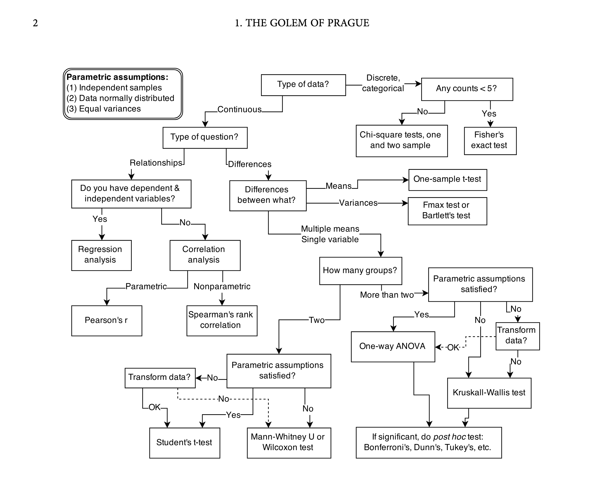

# Data Lunch: Week 1 {.center notes="notes/week1_notes.md#title"}

A Fresh Start

::: {.footer}
The Open Institute For Social Science
:::

# Most published research is false {notes="notes/week1_notes.md#published-research"}

::: {.r-stack}
{width="100%"}
[https://journals.plos.org/plosmedicine/article?id=10.1371/journal.pmed.0020124](https://journals.plos.org/plosmedicine/article?id=10.1371/journal.pmed.0020124)

:::{.fragment}
{.absolute left=900 top=390}

<div style="font-size: 150%; font-weight: bold; position: absolute; left: 900px; top: 780px;">
...and that's okay.
</div>
:::
:::

# This week's goals

:::{.nonincremental}
- Unpack the key concepts underlying Ioannidis's claim.
  - Statistical significance 
  - The base rate paradox
- Start rebuilding statistics from the ground up.
:::

# Statistical significance

::: {.columns}

::: {.column width="80%"}
::: {.fragment fragment-index=1}
> A result is statistically significant if, assuming the null hypothesis is true and the model assumptions hold, the probability of obtaining data at least as extreme as those observed (the p-value) is less than or equal to the chosen significance level α. This leads to rejection of the null hypothesis while controlling the long-run Type I error rate at α. (ChatGPT, 2026)
:::
:::

::: {.column width="20%"}
::: {.fragment fragment-index=2}
{.absolute top=0 right=0 width="15%"}
:::
:::

:::

<ul>
  <li class="fragment" data-fragment-index=2>If this confuses you, you're not alone. It is deeply unintuitive.</li>
  <li class="fragment">We are going to scrap all of this conceptual baggage and start over.</li>
</ul>


::: {notes="notes/week1_notes.md#goals"}
:::

# Probability

So what is probability? [It's just a way of talking about uncertainty.]{.fragment}

::: {.fragment}
There are two conventions worth knowing.
:::

::: {notes="notes/week1_notes.md#probability"}
:::


## Probability {.no-title}

_First convention: we measure probability as a number between 0 and 1 (0% to 100%)._

::: {.fragment}
In 2025, Kathmandu saw rain on 179 days:
:::

- P( rain ) = 179 / 365 = 0.49 (49%)


## Probability {.no-title}

_Second convention: we write statements about probability as P( event ) or P( event | condition )._

::: {.fragment}
We can do better with _conditional probabilities_:
:::

::: {.fragment .nonincremental}
- P( rain | Apr) = 13/30 (0.43)
- P( rain | Dec) = 0/31 (0.00)
- P( rain | Jul ) = 31/31 (1.00)
- P( rain | Feb ) = 2/28 (0.07)
:::


## Probability Examples

::: {.fragment .nonincremental}
- P( bachelors degree )
- P( bachelors degree | urban )
- P( bachelors degree | rural )
:::

- P( win | leading at halftime)
- P( disease | family history )
- P( rain today | rained yesterday )
- P( survival | attacked by bear )


# Applied probability

::: {.fragment}
In Nepal, HIV has a prevalence of about 0.1%. We can write that as:
:::

- P( HIV+ ) = 0.001 (0.1%)

::: {.fragment}
With statistical tests and predictions, we talk about two kinds of "accuracy":
:::

- **Sensitivity**: probability of a positive result testing a person who has HIV
- **Specificity**: probability of a negative test result testing a person who doesn't have HIV

::: {.fragment .nonincremental}
We can write these using our probability language:

- Sensitivity: P( test+ | HIV+ ) = 0.99 (99%)
- Specificity: P( test– | HIV– ) = 0.97 (97%)
:::

::: {notes="notes/week1_notes.md#applied-probability"}
:::

## Applied Probability (continued)

::: {.nonincremental}
- Sensitivity P( test+ | HIV+ ): 99%
- Specificity P( test– | HIV– ): 97%
:::

::: {.fragment fragment-index=1}
What about P( HIV+ | test+)? [3.2%]{.fragment fragment-index=2 .red}
:::

::: {.fragment fragment-index=3}

|[(pop: 100,000)]{.fragment fragment-index=4 .blue}           | Test+                                                            | Test–                                                             |
|----------|------------------------------------------------------------------|-------------------------------------------------------------------|
| **HIV+**<br>[(0.1%&nbsp;=&nbsp;100)]{.fragment fragment-index=5 .blue}| P( Test+ \| HIV+ ): **99%**<br>_Sensitivity (True Positive)_<br>[(99)]{.fragment fragment-index=6 .blue}| P( Test– \| HIV+ ): **1%**<br>_Type II Error (False Negative)_<br>[(1)]{.fragment fragment-index=6 .blue}|
| **HIV–**<br>[(99.9%&nbsp;=&nbsp;99,900)]{.fragment fragment-index=5 .blue} | P( Test+ \| HIV– ): **3%**<br>_Type I Error (False Positive)_<br>[(2,997)]{.fragment fragment-index=6 .blue}| P( Test– \| HIV– ): **97%**<br>_Specificity (True Negative)_<br>[(96,903)]{.fragment fragment-index=6 .blue}|
:::

::: {.fragment}
_Paradox: P(A|B) is not the same as P(B|A)_
:::

::: {notes="notes/week1_notes.md#base-rate"}
:::

# Base Rate Paradox {.no-title}
```{shinylive-r}
#| standalone: true

```

# Direction of conditions

_P(A|B) is not the same as P(B|A)_

<div style="margin: 120px">

|             | Sociology | Economics |                |
|-------------|-----------|-----------|----------------|
| **Urban**   |       240 |       300 | [_540_]{.gray} |
| **Rural**   |        80 |        20 | [_100_]{.gray} |
|             | [_320_]{.gray} | [_320_]{.gray} |      |
</div>


[P( Sociology | Rural )]{.red} = 80 / 100 = 0.80

[P( Rural | Sociology )]{.blue} = 80 / 320 = 0.25


# Statistical significance (revisited)

Let's look at that quote again:

> A result is statistically significant if, [assuming the null hypothesis is true]{.fragment fragment-index=2 .highlight-red} and the model assumptions hold, [the probability of obtaining data at least as extreme as those observed]{.fragment fragment-index=3 .highlight-blue} (the p-value) is less than or equal to the chosen significance level α. This leads to rejection of the null hypothesis while controlling the long-run Type I error rate at α.

::: {.fragment .nonincremental fragment-index=1}
Two key phrases: 
:::

<ul>
  <li class="fragment red" data-fragment-index=2>"assuming the null hypothesis is true"</li>
  <li class="fragment blue" data-fragment-index=3>"the probability of...data..."</li>
</ul>

::: {.fragment .nonincremental}
This frames _statistical significance_ as:

- P( [data]{.blue} | [hypothesis]{.red} )
:::

::: {.fragment .nonincremental}
Not the same as (what we usually actually want):

- P( [hypothesis]{.red} | [data]{.blue} )
:::


::: {notes="notes/week1_notes.md#statistical-significance-revisited"}
:::


# So why is most published research wrong?

::: {.fragment}
It's the same **base rate problem** as the HIV test:.
:::

::: {.fragment .nonincremental}
- A positive test &rarr; a [significant result]{.red} (p &lt; 0.05)
- Having the disease &rarr; the [hypothesis is actually true]{.blue}
- Interesting hypotheses are **rare**, the same way HIV is rare.
:::

::: {.fragment}
So most "significant" findings can be false positives, exactly as most positive HIV tests were.
:::

::: {notes="notes/week1_notes.md#why-research-wrong"}
:::

## The same table, relabeled {.no-title}

_[1%]{.blue} of tested hypotheses are true · [80%]{.blue} power · α = [5%]{.blue}_

::: {.fragment}

| 10,000 tested | [Significant]{.red} | Not significant |
|---|---|---|
| **True** [(100)]{.blue} | **80**<br>[true positive (80%)]{.gray} | 20<br>[false negative]{.gray} |
| **False** [(9,900)]{.blue} | **495**<br>[false positive (5%)]{.gray} | 9,405<br>[true negative]{.gray} |
:::

::: {.fragment}
P( [true]{.blue} | [significant]{.red} ) = 80 / (80 + 495) ≈ [**14%**]{.red}

About **86 of every 100** "discoveries" are false.
:::

## So why is most published research wrong? {.no-title}

That 14% was the _optimistic_ case. It gets worse when:

::: {.nonincremental}
- the base rate is even lower (genuinely novel ideas are rarer than 1%),
- studies are **underpowered** (real power is often much lower, even 20%),
- many comparisons are run, or results are [p-hacked]{.red} (effective α &gt;&gt; 5%).
:::

## The problem?
::: {.fragment}
- Statistical significance goes against our natural intuitions about uncertainty.
- If statistics has ever made you feel dumb or intimidated, it's not you...
- p-value is just a really weird concept.
:::

# Bayesian Updating

## Bayesian Updating: What it is not
{fig-align="center" width="100%"}


## Bayesian Updating: What it is

Instead of tests, we have Bayesian Updating:

- We have a **prior** belief about the world (specifically, about a parameter or "estimand").<br>[_I think that about 60% of Kathmandu will vote for the current mayor in the next election._]{.fragment .blue}
- Then, we observe something, and we estimate the **likelihood** of what we saw given our prior belief.<br>[_I just took a survey, and only 30% of people said they will vote for the current mayor. This doesn't really fit with what I expected._]{.fragment .blue}
- This new observation changes our prior belief (challenging it or making it stronger), to become our **posterior**.<br>[_I now think that about 45% of Kathmandu will vote for the current mayor in the next election._]{.fragment .blue}

::: {notes="notes/week1_notes.md#bayesian-updating"}
:::

# Bayesian Updating Example {.no-title}
```{shinylive-r}
#| standalone: true

```

# Bayes Theorem
::: {notes="notes/week1_notes.md#bayes-theorem"}
:::

$$
P(A|B) = \frac{P(B|A)\,P(A)}{P(B)}
$$

or

$$
\color{green}{P(\text{belief} \mid \text{data})}
=
\frac{
\color{#1b91ff}{P(\text{data} \mid \text{belief})}
\;\color{#ff2c2d}{P(\text{belief})}
}{
\color{#999}{P(\text{data})}
}
$$

- [**P(data | belief)**]{.blue}: likelihood
- [**P(belief)**]{.red}: prior probability
- [**P(belief | data)**]{.green}: posterior probability
- [**P(data)**]{.gray}: marginal likelihood (not interesting)


::: {.fragment .nonincremental}
In simple terms:

- prior × likelihood => posterior
:::

# Statistics is observation

- When we do ethnography, we _expect_ our data to be messy.
- We build knowledge not from one observation but from a process of theory building based on many observations.
- We need to start thinking about statistics in the same way.

::: {notes="notes/week1_notes.md#statistics-is-observation"}
:::

# Practical Work: Election polling

## The Bayesian workflow

- **Define the estimand**: state precisely what you want to know before touching data.
- **Draw the causal model (DAG)**: your assumptions about what causes what, from domain knowledge.
- **Simulate the population**: write a generative simulation that could produce data like yours.
- **Write the formal model**: derive the statistical model from the DAG, in mathematical notation.
- **Write the Stan code**: translate the formal model into a program.
- **Test on simulated data**: check that the model recovers known parameters, and that the priors imply plausible data.
- **Fit and validate the model**: run the sampler, check diagnostics (R-hat, ESS, trace plots, divergences), and run posterior predictive checks. *Is the model trustworthy?*
- **Compute the estimand and test its robustness**: poststratify to get the vote share, then run sensitivity analyses on turnout, poststratification targets, priors, and unmodeled non-response. *What is the result, and how much does it depend on our assumptions?*

# Demonstration: Will the mayor win? {notes="notes/week1_notes.md#poll-demo"}

Let's walk through the simplest possible version of this workflow.

::: {.nonincremental}
- **Estimand**: θ, the share of Kathmandu voters who will vote for the current mayor.
- **Background**: in the last election, the mayor got 60% of the vote.
- **Data**: we survey *n* voters at random, and *k* of them say they will vote for the mayor.
:::

::: {.fragment .callout-note}
## A deliberately simple model
Each respondent is like a coin flip that comes up "mayor" with probability θ. No weighting,
no turnout, no non-response, no post-stratification. We'll add those later.
:::

::: {.fragment}
$$
\begin{aligned}
k &\sim \text{Binomial}(n,\ \theta) && \color{#1b91ff}{\text{likelihood}} \\
\theta &\sim \text{your prior} && \color{#ff2c2d}{\text{prior}}
\end{aligned}
$$
:::

## Step 1: The prior {notes="notes/week1_notes.md#poll-prior"}

_Before seeing any survey, what do you believe about θ? Drag the points._

<style>
  .prior-layout{
    display: flex;
    gap: 16px;
    align-items: flex-start;
    width: 100%;
  }
  #poll-prior-graph{
    flex: 0 0 70%;
    aspect-ratio: 3/2;
  }
  #poll-prior-sheet{
    flex: 1 1 auto;
    min-width: 260px;
    font-size: 16pt;
  }
  .sheet-controls{
    margin-top: 8px;
    text-align: right;
  }
  #poll-prior-reset{
    font-size: 12pt;
    padding: 6px 10px;
  }
  .jss_about {
    display: none;
  }
  .jss_textarea{
    position: absolute !important;
    left: -10000px !important;
    top: 0 !important;
    width: 1px !important;
    height: 1px !important;
    opacity: 0 !important;
    pointer-events: none !important;
  }
</style>

```{=html}
<div class="prior-layout">
  <div id="poll-prior-graph"></div>
  <div>
    <div id="poll-prior-sheet"></div>
    <div class="sheet-controls">
      <button id="poll-prior-reset" type="button">Reset</button>
    </div>
  </div>
</div>
```

<script type="module">
  import { LineGraphWidget } from './js/graph.js';

  const graphEl = document.getElementById('poll-prior-graph');
  const sheetEl = document.getElementById('poll-prior-sheet');
  const resetBtn = document.getElementById('poll-prior-reset');
  // Shared with the posterior slide, which reads the prior from here
  const STORAGE_KEY = 'week1-poll-prior-v1';

  if (!graphEl || !sheetEl) {
    console.warn('Poll prior: missing graph or sheet container.');
  } else if (!graphEl.dataset.initialized) {
    graphEl.dataset.initialized = 'true';

    let widget = null;
    let ws = null;

    function loadStoredValues() {
      if (Array.isArray(window.__pollPrior)) return window.__pollPrior.slice();
      try {
        const raw = localStorage.getItem(STORAGE_KEY);
        if (!raw) return null;
        const parsed = JSON.parse(raw);
        if (!Array.isArray(parsed)) return null;
        return parsed.map((v) => Number(v));
      } catch {
        return null;
      }
    }

    function saveStoredValues(values) {
      window.__pollPrior = values.slice();
      window.dispatchEvent(new CustomEvent('poll-prior:change', { detail: values.slice() }));
      try {
        localStorage.setItem(STORAGE_KEY, JSON.stringify(values));
      } catch {
        // ignore storage errors
      }
    }

    function pointsToTable(points) {
      const ys = points.map(p => Number(p.y) || 0);
      const sum = ys.reduce((a, b) => a + b, 0);
      return ys.map((v,i) => [i*0.05, v, sum > 0 ? v / sum : 0]);
    }

    function getWorksheetHandle(obj) {
      if (!obj) return null;

      if (typeof obj.setData === 'function' ||
          typeof obj.loadData === 'function' ||
          typeof obj.setValueFromCoords === 'function' ||
          typeof obj.setValue === 'function') {
        return obj;
      }

      if (Array.isArray(obj)) return getWorksheetHandle(obj[0]);
      if (Array.isArray(obj.worksheets)) return getWorksheetHandle(obj.worksheets[0]);
      if (typeof obj.getWorksheet === 'function') return getWorksheetHandle(obj.getWorksheet(0));

      return null;
    }

    function updateSheet(points) {
      if (!ws) return;
      const data = pointsToTable(points);

      if (typeof ws.setData === 'function') {
        ws.setData(data);
        return;
      }
      if (typeof ws.loadData === 'function') {
        ws.loadData(data, true);
        return;
      }
      if (typeof ws.setValueFromCoords === 'function') {
        for (let r = 0; r < 21; r++) {
          ws.setValueFromCoords(0, r, data[r][0], true);
          ws.setValueFromCoords(1, r, data[r][1], true);
        }
        return;
      }
      if (typeof ws.setValue === 'function') {
        for (let r = 0; r < 21; r++) {
          ws.setValue(`A${r + 1}`, data[r][0], true);
          ws.setValue(`B${r + 1}`, data[r][1], true);
        }
      }
    }

    function ensureReadyThenInit() {
      const rect = graphEl.getBoundingClientRect();
      const visible = rect.width > 0 && rect.height > 0;
      if (!visible) return false;

      if (window.Reveal?.getCurrentSlide) {
        const cur = window.Reveal.getCurrentSlide();
        if (!cur?.querySelector('#poll-prior-graph')) return false;
      }

      if (!widget) {
        graphEl.innerHTML = '';
        sheetEl.innerHTML = '';

        const stored = loadStoredValues();
        const initialValues = Array.isArray(stored) && stored.length === 21
          ? stored
          : Array.from({ length: 21 }, () => 50);

        widget = new LineGraphWidget({
          container: graphEl,
          yValues: initialValues,
          onChange: (points) => {
            updateSheet(points);
            saveStoredValues(points.map((p) => p.y));
          },
        });

        const initData = pointsToTable(widget.getPoints());
        const created = window.jspreadsheet(sheetEl, {
          tabs: false,
          worksheets: [{
            data: initData,
            editable: false,
            minDimensions: [2, 21],
            rowHeaders: (rowIndex) => (rowIndex * 0.05).toFixed(2),
            allowInsertRow: false,
            allowDeleteRow: false,
            allowInsertColumn: false,
            allowDeleteColumn: false,
            columnSorting: false,
            columns: [
              { type: 'numeric', title: 'Voters', width: 90, mask: '0%' },
              { type: 'numeric', title: 'Score', width: 90, mask:'0.00' },
              { type: 'numeric', title: 'Probability', width: 120, mask: '0.0000' },
            ],
            selectionCopy: true,
            selection: true,
          }],
        });

        Promise.resolve(created).then((spreadsheet) => {
          ws = getWorksheetHandle(spreadsheet);
          if (!ws) {
            console.log('jspreadsheet return value:', spreadsheet);
            throw new Error('Could not find a worksheet handle. See console log for returned object.');
          }
          updateSheet(widget.getPoints());
        });

        if (resetBtn) {
          resetBtn.addEventListener('click', () => {
            widget.setYValues(Array.from({ length: 21 }, () => 50));
          });
        }

        // The posterior slide can hand its posterior back as a new prior
        window.addEventListener('poll-prior:set', (e) => {
          if (Array.isArray(e.detail)) widget.setYValues(e.detail);
        });
      }

      return true;
    }

    const observer = new ResizeObserver(() => {
      if (ensureReadyThenInit()) observer.disconnect();
    });
    observer.observe(graphEl);

    const runWhenReady = () => {
      if (!ensureReadyThenInit()) requestAnimationFrame(runWhenReady);
    };

    if (window.Reveal?.on) {
      Reveal.on('ready', runWhenReady);
      Reveal.on('slidechanged', runWhenReady);
    } else {
      window.addEventListener('load', runWhenReady);
      runWhenReady();
    }
  }
</script>

## Step 2: The likelihood {notes="notes/week1_notes.md#poll-likelihood"}

_We survey 20 voters. 6 of them (30%) say they will vote for the mayor._

::: {.columns}
::: {.column width="55%"}
```{r}
#| fig-width: 7
#| fig-height: 5
#| out-width: "100%"
n <- 20
k <- 6
marks <- c(0.3, 0.5, 0.6, 0.8)

curve(
  dbinom(k, n, x),
  from = 0,
  to = 1,
  n = 501,
  xlab = "θ (share voting for the mayor)",
  ylab = "P( 6 of 20 | θ )",
  col = "#1b91ff",
  lwd = 3
)
segments(marks, 0, marks, dbinom(k, n, marks), lty = 2, col = "#999")
points(marks, dbinom(k, n, marks), pch = 19, col = "#1b91ff", cex = 1.4)
```
:::

::: {.column width="45%"}
How consistent is "6 of 20" with each possible value of θ?

::: {.nonincremental}
- If θ = 30%: P( 6 of 20 ) = `r round(dbinom(6, 20, 0.3), 3)`
- If θ = 50%: P( 6 of 20 ) = `r round(dbinom(6, 20, 0.5), 3)`
- If θ = 60%: P( 6 of 20 ) = `r round(dbinom(6, 20, 0.6), 3)`
- If θ = 80%: P( 6 of 20 ) = `r format(signif(dbinom(6, 20, 0.8), 2), scientific = FALSE)`
:::

::: {.fragment}
The likelihood is **not** a belief. It's what the coin-flip process in the world says about
our data, one candidate value of θ at a time.
:::
:::
:::

## Step 3: Prior × likelihood → posterior {notes="notes/week1_notes.md#poll-posterior"}

<style>
  .poll-layout{
    display: flex;
    gap: 24px;
    align-items: flex-start;
    width: 100%;
  }
  #poll-post-graph{
    flex: 0 0 64%;
    aspect-ratio: 3/2;
  }
  .poll-side{
    flex: 1 1 auto;
    display: flex;
    flex-direction: column;
    gap: 6px;
    font-size: 18pt;
  }
  .poll-side input[type="range"]{
    width: 100%;
  }
  .poll-side table.poll-stats{
    font-size: 16pt;
    width: 100%;
    margin-top: 16px;
  }
  .poll-side table.poll-stats td,
  .poll-side table.poll-stats th{
    padding: 4px 8px;
  }
  #poll-msg{
    font-size: 14pt;
    color: #ff2c2d;
    min-height: 1.2em;
  }
  #poll-carry{
    font-size: 12pt;
    padding: 6px 10px;
    align-self: flex-end;
  }
</style>

```{=html}
<div class="poll-layout">
  <div id="poll-post-graph"></div>
  <div class="poll-side">
    <label for="poll-n">People surveyed: <b id="poll-n-out"></b></label>
    <input type="range" id="poll-n" min="0" max="500" step="1" value="20">
    <label for="poll-share">Said "mayor": <b id="poll-share-out"></b></label>
    <input type="range" id="poll-share" min="0" max="100" step="1" value="30">
    <table class="poll-stats">
      <thead>
        <tr><th></th><th class="red">Prior</th><th class="green">Posterior</th></tr>
      </thead>
      <tbody>
        <tr><td>Best guess</td><td id="poll-prior-mean"></td><td id="poll-post-mean"></td></tr>
        <tr><td>90% range</td><td id="poll-prior-range"></td><td id="poll-post-range"></td></tr>
        <tr><td>P( mayor wins )</td><td id="poll-prior-win"></td><td id="poll-post-win"></td></tr>
      </tbody>
    </table>
    <div id="poll-msg"></div>
    <button id="poll-carry" type="button">Make this posterior my new prior</button>
  </div>
</div>
```

<script type="module">
  import { PosteriorPlot } from './js/posterior.js';

  const STORAGE_KEY = 'week1-poll-prior-v1';
  const COLORS = { prior: '#ff2c2d', likelihood: '#1b91ff', posterior: 'green' };

  // Fine grid over θ; the 21 prior points are interpolated onto it
  const G = 201;
  const xs = Array.from({ length: G }, (_, i) => i / (G - 1));
  const dx = 1 / (G - 1);

  const $ = (id) => document.getElementById(id);
  const graphEl = $('poll-post-graph');

  if (graphEl && !graphEl.dataset.initialized) {
    graphEl.dataset.initialized = 'true';

    const plot = new PosteriorPlot({ container: graphEl });
    const nInput = $('poll-n');
    const shareInput = $('poll-share');
    let priorPoints = loadPrior();

    function loadPrior() {
      if (Array.isArray(window.__pollPrior)) return window.__pollPrior.slice();
      try {
        const parsed = JSON.parse(localStorage.getItem(STORAGE_KEY));
        if (Array.isArray(parsed) && parsed.length === 21) return parsed.map(Number);
      } catch {
        // ignore storage errors
      }
      return Array.from({ length: 21 }, () => 50);
    }

    function interpolate(points) {
      return xs.map((x) => {
        const p = x / 0.05;
        const i = Math.min(19, Math.floor(p));
        const t = p - i;
        return points[i] * (1 - t) + points[i + 1] * t;
      });
    }

    // Probability mass on each grid point (sums to 1), or null if all zero
    function toMass(v) {
      const s = v.reduce((a, b) => a + b, 0);
      return s > 0 ? v.map((a) => a / s) : null;
    }

    // Binomial likelihood up to a constant, computed on the log scale so
    // large surveys don't underflow
    function likelihood(k, n) {
      const ll = xs.map((x) => {
        let l = 0;
        if (k > 0) l += k * Math.log(x);
        if (n - k > 0) l += (n - k) * Math.log(1 - x);
        return l;
      });
      const m = Math.max(...ll.filter(Number.isFinite));
      return ll.map((l) => (Number.isFinite(l) ? Math.exp(l - m) : 0));
    }

    function summarize(mass) {
      const mean = mass.reduce((a, w, i) => a + w * xs[i], 0);
      const quantile = (q) => {
        let cum = 0;
        for (let i = 0; i < G; i++) {
          cum += mass[i];
          if (cum >= q) return xs[i];
        }
        return 1;
      };
      let win = 0;
      for (let i = 0; i < G; i++) {
        if (xs[i] > 0.5) win += mass[i];
        else if (xs[i] === 0.5) win += mass[i] / 2;
      }
      return { mean, lo: quantile(0.05), hi: quantile(0.95), win };
    }

    const pct = (x) => `${Math.round(x * 100)}%`;
    const prob = (x) => (x < 0.01 ? '< 1%' : x > 0.99 ? '> 99%' : pct(x));

    function showStats(prefix, s) {
      $(`poll-${prefix}-mean`).textContent = s ? pct(s.mean) : '—';
      $(`poll-${prefix}-range`).textContent = s ? `${pct(s.lo)} – ${pct(s.hi)}` : '—';
      $(`poll-${prefix}-win`).textContent = s ? prob(s.win) : '—';
    }

    let posteriorMass = null;

    function update() {
      const n = Number(nInput.value);
      const k = Math.round((n * Number(shareInput.value)) / 100);
      $('poll-n-out').textContent = n;
      $('poll-share-out').textContent = `${k} of ${n} (${n > 0 ? pct(k / n) : '—'})`;

      const prior = toMass(interpolate(priorPoints));
      const lik = toMass(likelihood(k, n));
      const post = prior ? toMass(prior.map((p, i) => p * lik[i])) : null;
      posteriorMass = post;

      showStats('prior', prior && summarize(prior));
      showStats('post', post && summarize(post));
      $('poll-msg').textContent = !prior
        ? 'Your prior rules out every value of θ.'
        : !post
          ? 'Your prior rules out everything the data allow.'
          : '';
      $('poll-carry').disabled = !post;

      const density = (m) => (m ? m.map((w) => w / dx) : xs.map(() => 0));
      plot.setSeries([
        { label: 'Prior', color: COLORS.prior, xs, ys: density(prior) },
        { label: 'Likelihood', color: COLORS.likelihood, xs, ys: density(lik), dash: [8, 6] },
        { label: 'Posterior', color: COLORS.posterior, xs, ys: density(post), fill: 'rgba(0,128,0,0.12)' },
      ]);
    }

    nInput.addEventListener('input', update);
    shareInput.addEventListener('input', update);

    window.addEventListener('poll-prior:change', (e) => {
      if (Array.isArray(e.detail)) {
        priorPoints = e.detail.slice();
        update();
      }
    });

    // Today's posterior is tomorrow's prior: sample it back onto the 21
    // draggable points, then clear the survey so the data isn't counted twice
    $('poll-carry').addEventListener('click', () => {
      if (!posteriorMass) return;
      const coarse = Array.from({ length: 21 }, (_, i) => posteriorMass[i * 10]);
      const max = Math.max(...coarse);
      if (!(max > 0)) return;
      const values = coarse.map((v) => (v / max) * 100);

      priorPoints = values;
      window.__pollPrior = values.slice();
      try {
        localStorage.setItem(STORAGE_KEY, JSON.stringify(values));
      } catch {
        // ignore storage errors
      }
      window.dispatchEvent(new CustomEvent('poll-prior:set', { detail: values.slice() }));
      nInput.value = 0;
      update();
    });

    update();
  }
</script>

## What to try {notes="notes/week1_notes.md#poll-try"}

::: {.nonincremental}
- **Flat prior vs. strong prior.** Draw a flat prior, then a narrow one around 60% (last
  election). With the same survey, how far apart are the posteriors?
- **More data.** Keep the survey at 30%, but raise *n* from 20 to 500. What happens to the
  prior's influence?
- **Updating in sequence.** Make the posterior your new prior, then run a second survey.
  Yesterday's posterior is today's prior.
- **Answering the real question.** P( mayor wins ) is a direct statement about the hypothesis
  given the data: [P( hypothesis | data )]{.green}, not a p-value.
:::

::: {.fragment}
*What is the result, and how much does it depend on our assumptions?* This is that question,
in miniature.
:::
