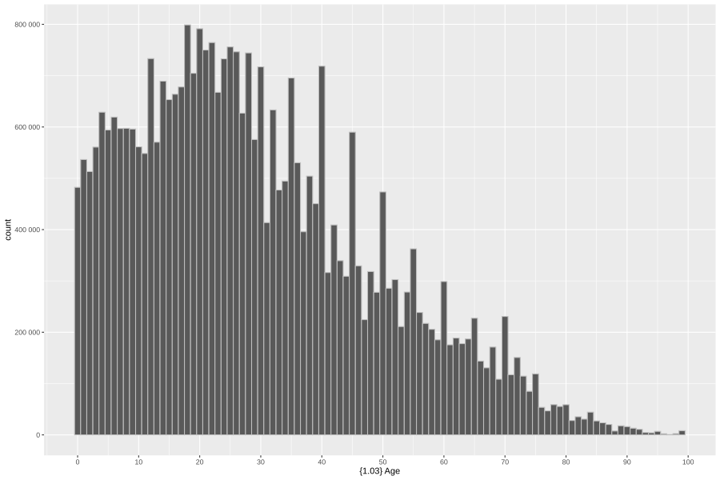

---
format:
  revealjs:
    self-contained: false
    include-in-header:
      - text: |
          <script src="js/dagitty.js"></script>
          <script src="js/graph.js" type="module"></script>
          <script src="https://cdn.jsdelivr.net/npm/jspreadsheet-ce@5/dist/index.js"></script>
          <link rel="stylesheet" href="https://cdn.jsdelivr.net/npm/jspreadsheet-ce@5/dist/jspreadsheet.css">
          <script src="https://cdn.jsdelivr.net/npm/jsuites@5/dist/jsuites.js"></script>
          <link rel="stylesheet" href="https://cdn.jsdelivr.net/npm/jsuites@5/dist/jsuites.css">
---


# Data Lunch: Week 2 {.center}

Describing uncertainty


# Airplanes return from battle
<!-- TODO: turn this into an animation of some sort -->
:::{.r-stack}
{width="80%" style="text-align:center;"}
:::

# Population histogram
<!-- TODO: Add NLSS age data. Why the bumps? -->
{width="80%" style="text-align:center;"}

# Randomness has patterns

# The three parts of statistical questions

Problem: we want to understand how the admissions process works at a university. 

::: {.fragment .callout-note}
## Population: This isn't about one individual case but rather a group of cases
- "Applications to this university last year"
- "Applications to this university in the last ten years"
- "Applications to all state-run universities in this country last year"
:::

::: {.fragment .callout-tip}
## Variation: These cases are different from each other in ways that interest us
- "Exam results"
- "Family wealth"
- "Gender"
- "Department"
:::

::: {.fragment .callout-important}
## Randomness: Reality is messy, and we'll never predict admission perfectly. But, randomness has patterns. We can describe how it was generated.
- If I flip a coin 1 time, I can't say what will happen. 
- If I flip a coin 1000 times, I can say a lot more. 
- Random individuals → Predictable populations
:::


# Goals this week
- Get more specific about "beliefs"
  - Concept: Parameters
  - Concept: Probability Distributions
- Learn how to use Bayes Theorem
  - Concept: Priors and posteriors
  - Concept: Likelihood
- Design a real analysis


# Parameters: What is a "belief"?

- Beliefs _about what?_
  - "parameters": unknown numerical quantities in the world
  - "estimand": what we want to find out (often a parameter)

- Refined Definition:
  - P(belief): P(belief about the possible values of a parameter)
  - Shorthand: P(params) or P(Θ)


# Parameters: Examples

A parameter is a numerical fact about the world that we don't know (but want to find out)

- The average height of adults in Pokhara
- The number of cars driven in Kathmandu on a typical Saturday
- The average exam results in a particular school
- The difference between men's and women's salaries
- The effect of socioeconomic status on college admissions
- The effect of education level on moral judgments


# Probability distributions

::: {.fragment .callout-note .nonincremental}
- We talk about probability distributions all the time: "He's probably about 50, but he could be quite a bit older". 
- Here, we're just visualizing that kind of description over the range of all possible values.
:::

::: {.columns}

::: {.column width="30%"}
::: {.fragment}
<p style="font-size: 12pt;"><b>Uninformed</b> I have no idea. He could be between 0 and 100 and I don't think any possibility is more likely than any other.</p>
```{r}
curve(dunif(x, min = 0, max = 100),
      from = 0, to = 100,
      xlab = "Age", ylab = "Density",
      col="red", lwd=2)
```

:::

::: {.fragment}
<p style="font-size: 12pt"><b>Weakly informed</b> He seems like he's about 50, but I could be very wrong about that. Anything between 30 and 70 seems plausible and even more extreme values are possible.</p>
```{r}
curve(dnorm(x, mean = 50, sd = 15),
      from = 0, to = 100,
      ylim=c(0,0.1),
      xlab = "Age", ylab = "Density",
      col="red", lwd=2)
```
:::
:::

::: {.column width="40%"}
::: {.fragment fragment-index=1}
{height="550px" style="text-align:center;"}
:::
:::

::: {.column width="30%"}
::: {.fragment }
<p style="font-size: 12pt"><b>Strongly informed</b> I'm quite certain that he's fifty or relatively close to it.</p>
```{r}
curve(dnorm(x, mean = 50, sd = 1),
      from = 0, to = 100,
      xlab = "Age", ylab = "Density",
      col="red", lwd=2)
```
:::

::: {.fragment}
<p style="font-size: 12pt"><b>Domain-specific distributions</b> I'm relatively certain he's between 40 and 60, but I have really no idea where in that range he lands. Older or younger than that seems unlikely, though.</p>

```{r}
# Steeper sides: shrink the taper width b
a <- 20   # plateau width (40 to 60)
b <- 15   # smaller = steeper sides

w <- function(x) {
  y <- numeric(length(x))

  L1 <- 50 - (a/2 + b); L2 <- 50 - a/2
  i <- x >= L1 & x < L2
  y[i] <- 0.5 * (1 - cos(pi * (x[i] - L1) / b))

  i <- x >= (50 - a/2) & x <= (50 + a/2)
  y[i] <- 1

  R1 <- 50 + a/2; R2 <- 50 + (a/2 + b)
  i <- x > R1 & x <= R2
  y[i] <- 0.5 * (1 + cos(pi * (x[i] - R1) / b))

  y
}

A <- integrate(w, 0, 100)$value
curve(w(x) / A, from = 0, to = 100, ylim=c(0, 0.05), xlab = "Age", ylab = "Density", col="red", lwd=2)
```

:::
:::

:::


# Practical: Who will win the election?
- Last election: the current candidate got 60% of the votes.
- We have the resources to conduct a survey.
- (Many non-statistical problems to solve when we design a survey.)
- What do we need to provide a meaningful statistical answer?

# Practical: Bayes Theorem

$$
\color{green}{P(\text{belief} \mid \text{data})}
=
\frac{
\color{#1b91ff}{P(\text{data} \mid \text{belief})}
\;\color{#ff2c2d}{P(\text{belief})}
}{
\color{#999}{P(\text{data})}
}
$$

:::{.nonincremental}
- [**P(belief)**]{.red}: prior 
- [**P(belief | data)**]{.green}: posterior
- [**P(data | belief)**]{.blue}: likelihood
- [**P(data)**]{.gray}: marginal likelihood (not interesting)
:::

prior ⨉ likelihood → posterior


# Priors and Posteriors: Updating
P(belief) → P(belief | data)

::: {.columns}

::: {.column}
::: {.r-stack}
::: {.fragment}
```{r}
curve(dnorm(x, mean = 60, sd = 10), from = 0, to = 100, ylim = c(0, 0.1), col="red", xlab="", lwd=2, ylab="")
legend("topright", legend = c("Prior", "Posterior"), col = c("red", "blue"), lwd=2)
```
:::
::: {.fragment}
```{r}
# plot(y ~ rnorm(0, 1))
curve(dnorm(x, mean = 60, sd = 10), from = 0, to = 100, ylim = c(0, 0.1), col="red", lwd=2, xlab="", ylab="")
curve(dnorm(x, mean = 40, sd = 10), from = 0, to = 100, col="blue", lwd=2, add=TRUE)
legend("topright", legend = c("Prior", "Posterior"), col = c("red", "blue"), lwd=2)
```
:::
:::
:::

::: {.column}
::: {.r-stack}
::: {.fragment}
```{r}
curve(dnorm(x, mean = 40, sd = 10), from = 0, to = 100, ylim = c(0, 0.1), col="red", xlab="", ylab="", lwd=2)
legend("topright", legend = c("Prior", "Posterior"), col = c("red", "blue"), lwd=2)
```
:::
::: {.fragment}
```{r}
# plot(y ~ rnorm(0, 1))
curve(dnorm(x, mean = 40, sd = 10), from = 0, to = 100, ylim = c(0, 0.1), col="red", lwd=2, xlab="", ylab="")
curve(dnorm(x, mean = 40, sd = 5), from = 0, to = 100, col="blue", lwd=2, add=TRUE)
legend("topright", legend = c("Prior", "Posterior"), col = c("red", "blue"), lwd=2)
```
:::
:::
:::
:::


::: {.columns}
::: {.column}
::: {.r-stack}
::: {.fragment}
```{r}
curve(dnorm(x, mean = 40, sd = 5), from = 0, to = 100, ylim = c(0, 0.1), col="red", lwd=2, xlab="", ylab="")
legend("topright", legend = c("Prior", "Posterior"), col = c("red", "blue"), lwd=2)
```
:::
::: {.fragment}
```{r}
# plot(y ~ rnorm(0, 1))
curve(dnorm(x, mean = 40, sd = 5), from = 0, to = 100, ylim = c(0, 0.1), col="red", lwd=2, xlab="", ylab="")
curve(dnorm(x, mean = 35, sd = 4), from = 0, to = 100, col="blue", lwd=2, add=TRUE)
legend("topright", legend = c("Prior", "Posterior"), col = c("red", "blue"), lwd=2)
```
:::
:::
:::

::: {.column}
::: {.r-stack}
::: {.fragment}
```{r}
curve(dnorm(x, mean = 35, sd = 4), from = 0, to = 100, ylim = c(0, 0.1), col="red", lwd=2, xlab="", ylab="")
legend("topright", legend = c("Prior", "Posterior"), col = c("red", "blue"), lwd=2)
```
:::
::: {.fragment}
```{r}
# plot(y ~ rnorm(0, 1))
curve(dnorm(x, mean = 35, sd = 4), from = 0, to = 100, ylim = c(0, 0.1), col="red", lwd=2, xlab="", ylab="")
curve(dnorm(x, mean = 50, sd = 10), from = 0, to = 100, col="blue", lwd=2, add=TRUE)
legend("topright", legend = c("Prior", "Posterior"), col = c("red", "blue"), lwd=2)
```
:::
:::
:::
:::


# Priors and Posteriors: DIY Prior

<style>
  .prior-layout{
    display: flex;
    gap: 16px;
    align-items: stretch;
    width: 100%;
  }
  #graph-wrapper{
    flex: 0 0 70%;
    aspect-ratio: 3/2;
  }
  #sheet-wrapper{
    flex: 1 1 auto;
    min-width: 260px;
    font-size: 16pt;
  }
  .sheet-controls{
    margin-top: 8px;
    text-align: right;
  }
  #sheet-reset{
    font-size: 12pt;
    padding: 6px 10px;
  }
  .jss_about {
    display: none;
  }
  .jss_textarea{
    position: absolute !important;
    left: -10000px !important;
    top: 0 !important;
    width: 1px !important;
    height: 1px !important;
    opacity: 0 !important;
    pointer-events: none !important;
  }
</style>

```{=html}
<div class="prior-layout">
  <div id="graph-wrapper"></div>
  <div>
    <div id="sheet-wrapper"></div>
    <div class="sheet-controls">
      <button id="sheet-reset" type="button">Reset</button>
    </div>
  </div>
</div>
```

<script type="module">
  import { LineGraphWidget } from './js/graph.js';

  const graphEl = document.getElementById('graph-wrapper');
  const sheetEl = document.getElementById('sheet-wrapper');
  const resetBtn = document.getElementById('sheet-reset');
  const STORAGE_KEY = 'diy-prior-values-v1';

  if (!graphEl || !sheetEl) {
    console.warn('DIY Prior: missing graph or sheet container.');
  } else if (!graphEl.dataset.initialized) {
    graphEl.dataset.initialized = 'true';

    let widget = null;
    let ws = null;

    function loadStoredValues() {
      try {
        const raw = localStorage.getItem(STORAGE_KEY);
        if (!raw) return null;
        const parsed = JSON.parse(raw);
        if (!Array.isArray(parsed)) return null;
        return parsed.map((v) => Number(v));
      } catch {
        return null;
      }
    }

    function saveStoredValues(values) {
      try {
        localStorage.setItem(STORAGE_KEY, JSON.stringify(values));
      } catch {
        // ignore storage errors
      }
    }

    function pointsToTable(points) {
      const ys = points.map(p => Number(p.y) || 0);
      const sum = ys.reduce((a, b) => a + b, 0);
      return ys.map((v,i) => [i*0.05, v, sum > 0 ? v / sum : 0]);
    }

    function getWorksheetHandle(obj) {
      if (!obj) return null;

      if (typeof obj.setData === 'function' ||
          typeof obj.loadData === 'function' ||
          typeof obj.setValueFromCoords === 'function' ||
          typeof obj.setValue === 'function') {
        return obj;
      }

      if (Array.isArray(obj)) return getWorksheetHandle(obj[0]);
      if (Array.isArray(obj.worksheets)) return getWorksheetHandle(obj.worksheets[0]);
      if (typeof obj.getWorksheet === 'function') return getWorksheetHandle(obj.getWorksheet(0));

      return null;
    }

    function updateSheet(points) {
      if (!ws) return;
      const data = pointsToTable(points);

      if (typeof ws.setData === 'function') {
        ws.setData(data);
        return;
      }
      if (typeof ws.loadData === 'function') {
        ws.loadData(data, true);
        return;
      }
      if (typeof ws.setValueFromCoords === 'function') {
        for (let r = 0; r < 21; r++) {
          ws.setValueFromCoords(0, r, data[r][0], true);
          ws.setValueFromCoords(1, r, data[r][1], true);
        }
        return;
      }
      if (typeof ws.setValue === 'function') {
        for (let r = 0; r < 21; r++) {
          ws.setValue(`A${r + 1}`, data[r][0], true);
          ws.setValue(`B${r + 1}`, data[r][1], true);
        }
      }
    }

    function ensureReadyThenInit() {
      const rect = graphEl.getBoundingClientRect();
      const visible = rect.width > 0 && rect.height > 0;
      if (!visible) return false;

      if (window.Reveal?.getCurrentSlide) {
        const cur = window.Reveal.getCurrentSlide();
        if (!cur?.querySelector('#graph-wrapper')) return false;
      }

      if (!widget) {
        graphEl.innerHTML = '';
        sheetEl.innerHTML = '';

        const stored = loadStoredValues();
        const initialValues = Array.isArray(stored) && stored.length === 21
          ? stored
          : Array.from({ length: 21 }, () => 50);

        widget = new LineGraphWidget({
          container: graphEl,
          yValues: initialValues,
          onChange: (points) => {
            updateSheet(points);
            saveStoredValues(points.map((p) => p.y));
          },
        });

        const initData = pointsToTable(widget.getPoints());
        const created = window.jspreadsheet(sheetEl, {
          tabs: false,
          worksheets: [{
            data: initData,
            editable: false,
            minDimensions: [2, 21],
            rowHeaders: (rowIndex) => (rowIndex * 0.05).toFixed(2),
            allowInsertRow: false,
            allowDeleteRow: false,
            allowInsertColumn: false,
            allowDeleteColumn: false,
            columnSorting: false,
            columns: [
              { type: 'numeric', title: 'Voters', width: 90, mask: '0%' },
              { type: 'numeric', title: 'Score', width: 90, mask:'0.00' },
              { type: 'numeric', title: 'Probability', width: 120, mask: '0.0000' },
            ],
            selectionCopy: true,   // enables copying selected range
            selection: true,       // ensures range selection is on (harmless if default)
          }],
        });

        Promise.resolve(created).then((spreadsheet) => {
          ws = getWorksheetHandle(spreadsheet);
          if (!ws) {
            console.log('jspreadsheet return value:', spreadsheet);
            throw new Error('Could not find a worksheet handle. See console log for returned object.');
          }
          updateSheet(widget.getPoints());
        });

        if (resetBtn) {
          resetBtn.addEventListener('click', () => {
            const resetValues = Array.from({ length: 21 }, () => 50);
            widget.setYValues(resetValues);
            saveStoredValues(resetValues);
          });
        }
      }

      return true;
    }

    const observer = new ResizeObserver(() => {
      if (ensureReadyThenInit()) observer.disconnect();
    });
    observer.observe(graphEl);

    const runWhenReady = () => {
      if (!ensureReadyThenInit()) requestAnimationFrame(runWhenReady);
    };

    if (window.Reveal?.on) {
      Reveal.on('ready', runWhenReady);
      Reveal.on('slidechanged', runWhenReady);
    } else {
      window.addEventListener('load', runWhenReady);
      runWhenReady();
    }
  }
</script>


# Likelihood: Probability in the World
:::{.r-stack}

:::{.fragment .fade-in-then-out}
{width="900px"}
:::

:::{.fragment}
{width="900px"}
:::

:::

::: {.fragment}
Probability isn't just in our heads. Sometimes, it's generated by a process in the world.
:::


# Likelihood: Building Models
- From Bayes theorem, we know that likelihood is: P( data | parameters )
- But what does this mean?

::: {.fragment .callout-tip}
## Instead of starting with our beliefs, likelihood starts with what we *saw*.
We surveyed 15 people and 4 said that they will vote for the current mayor.
:::

- Now, we need to ask, "How consistent is this observation with different possible values of our parameter?"
- Given a particular parameter value, how likely is the data we saw?
  - If our parameter is _actually_ 50%, what are the chances of seeing 4 out of 15?
  - If our parameter is _actually_ 30%, what are the chances of seeing 4 out of 15?
  - If our parameter is _actually_ 80%, what are the chances of seeing 4 out of 15?

::: {.fragment}
These are questions that any calculator can answer.
:::

# Likelihood: So what it is
<!-- TODO: Expand this to include a better comparison -->
- For priors and posteriors, randomness is about our uncertainty (a subjective experience).
- For likelihood, randomness is generated by specific processes in the world.
- Our job is to describe how patterns of variation (including randomness) occur.

# Distributions Demo {.no-title}

```{shinylive-r}
#| standalone: true

``` 

# Grid approximation worksheet
<!-- TODO: Implement worksheet -->

<div id="sheet1" style="width:100%; font-size: 14pt;"></div>

<script>
(() => {
  const el = document.getElementById("sheet1");

  const rows = 21, cols = 8;
  const data = Array.from({ length: rows }, () => Array(cols).fill(0));

  const columns = Array.from({ length: cols }, (_, i) => ({
    type: "numeric",
    title: `Col ${i + 1}`,
    width: 150
  }));

  // Newer API: worksheets is required
  window.sheet1 = jspreadsheet(el, {
    plugins: [
      // clipboard plugin is typically exposed as `jspreadsheet.plugins.clipboard`
      // jspreadsheet.plugins.clipboard
    ],
    worksheets: [{
      data,
      columns,
      minDimensions: [cols, rows]
    }],
    tableOverflow: true,
    tableWidth: "100%",
    tableHeight: "420px"
  });
})();
</script>