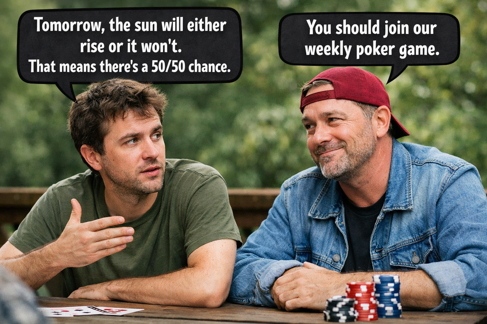

---
format:
  revealjs:
    self-contained: false
    include-in-header:
      - text: |
          <script src="js/dagitty.js"></script>
          <script src="js/graph.js" type="module"></script>
          <script src="js/jspreadsheet.js"></script>
          <script src="js/jspreadsheet-charts.min.js"></script>
          <script src="js/jsuites.js"></script>
          <link rel="stylesheet" href="https://cdn.jsdelivr.net/npm/jspreadsheet-ce@5/dist/jspreadsheet.css">
          <link rel="stylesheet" href="https://cdn.jsdelivr.net/npm/jsuites@5/dist/jsuites.css">
---


# Data Lunch: Week 2 {.center}

Describing uncertainty

# The three components of statistics

- Population
- Variation
- Randomness

::: {.fragment .nonincremental .callout-note}
## Random individuals → Predictable populations

- If I flip a coin 1 time, I can't say what will happen. 
- If I flip a coin 1000 times, I can say a lot more. 
:::


# Relationships of Cause and Effect

```{=html}
<iframe
  id="dag-frame-1"
  data-external="1"
  style="width:100%; aspect-ratio: 2 / 1; border:1px solid black;"
  src="https://dagitty.net/dags.html"
></iframe>
<!-- <iframe
  id="dag-frame-1"
  data-external="1"
  style="width:100%; aspect-ratio: 2 / 1; border:1px solid black;"
  src="js/dag-embed.html"
></iframe> -->

<!-- <script>
(() => {
  const dag = `dag {
    Admitted [outcome,pos="-0.619,0.077"]
    Department [exposure,pos="-0.858,0.192"]
    Sex [exposure,pos="-1.059,-0.272"]
    UNKNOWN [latent,pos="-0.414,0.077"]
    Department -> Admitted  
    Sex -> Admitted
    Sex -> Department
    UNKNOWN -> Admitted
  }`;

  const frame = document.getElementById("dag-frame-1");

  function send() {
    if (!frame?.contentWindow) return;
    frame.contentWindow.postMessage({ type: "dagitty", dag }, "*");
  }

  frame.addEventListener("load", send);

  // Optional: re-send when returning to the slide (Reveal may not exist in non-reveal contexts)
  window.addEventListener("load", () => {
    if (window.Reveal?.on) {
      Reveal.on("ready", send);
      Reveal.on("slidechanged", (e) => {
        if (e.currentSlide?.querySelector("#dag-frame-1")) send();
      });
    }
  });
})();
</script> -->
```

# Who is going to win the election?
- Last election: the current candidate got 60% of the votes.
- We have the resources to conduct a survey.
- (Many non-statistical problems to solve when we design a survey.)
- What do we need to provide a meaningful statistical answer?

# Bayes Theorem in practice

$$
\color{green}{P(\text{belief} \mid \text{data})}
=
\frac{
\color{#1b91ff}{P(\text{data} \mid \text{belief})}
\;\color{#ff2c2d}{P(\text{belief})}
}{
\color{#999}{P(\text{data})}
}
$$

:::{.nonincremental}
- [**P(belief)**]{.red}: prior 
- [**P(belief | data)**]{.green}: posterior
- [**P(data | belief)**]{.blue}: likelihood
- [**P(data)**]{.gray}: marginal likelihood (not interesting)
:::

prior ⨉ likelihood → posterior


# Updating: Priors become Posteriors
P(belief) → P(belief | data)

::: {.columns}

::: {.column}
::: {.r-stack}
::: {.fragment}
```{r}
curve(dnorm(x, mean = 60, sd = 10), from = 0, to = 100, ylim = c(0, 0.1), col="red", xlab="", lwd=2, ylab="")
legend("topright", legend = c("Prior", "Posterior"), col = c("red", "blue"), lwd=2)
```
:::
::: {.fragment}
```{r}
# plot(y ~ rnorm(0, 1))
curve(dnorm(x, mean = 60, sd = 10), from = 0, to = 100, ylim = c(0, 0.1), col="red", lwd=2, xlab="", ylab="")
curve(dnorm(x, mean = 40, sd = 10), from = 0, to = 100, col="blue", lwd=2, add=TRUE)
legend("topright", legend = c("Prior", "Posterior"), col = c("red", "blue"), lwd=2)
```
:::
:::
:::

::: {.column}
::: {.r-stack}
::: {.fragment}
```{r}
curve(dnorm(x, mean = 40, sd = 10), from = 0, to = 100, ylim = c(0, 0.1), col="red", xlab="", ylab="", lwd=2)
legend("topright", legend = c("Prior", "Posterior"), col = c("red", "blue"), lwd=2)
```
:::
::: {.fragment}
```{r}
# plot(y ~ rnorm(0, 1))
curve(dnorm(x, mean = 40, sd = 10), from = 0, to = 100, ylim = c(0, 0.1), col="red", lwd=2, xlab="", ylab="")
curve(dnorm(x, mean = 40, sd = 5), from = 0, to = 100, col="blue", lwd=2, add=TRUE)
legend("topright", legend = c("Prior", "Posterior"), col = c("red", "blue"), lwd=2)
```
:::
:::
:::
:::


::: {.columns}
::: {.column}
::: {.r-stack}
::: {.fragment}
```{r}
curve(dnorm(x, mean = 40, sd = 5), from = 0, to = 100, ylim = c(0, 0.1), col="red", lwd=2, xlab="", ylab="")
legend("topright", legend = c("Prior", "Posterior"), col = c("red", "blue"), lwd=2)
```
:::
::: {.fragment}
```{r}
# plot(y ~ rnorm(0, 1))
curve(dnorm(x, mean = 40, sd = 5), from = 0, to = 100, ylim = c(0, 0.1), col="red", lwd=2, xlab="", ylab="")
curve(dnorm(x, mean = 35, sd = 4), from = 0, to = 100, col="blue", lwd=2, add=TRUE)
legend("topright", legend = c("Prior", "Posterior"), col = c("red", "blue"), lwd=2)
```
:::
:::
:::

::: {.column}
::: {.r-stack}
::: {.fragment}
```{r}
curve(dnorm(x, mean = 35, sd = 4), from = 0, to = 100, ylim = c(0, 0.1), col="red", lwd=2, xlab="", ylab="")
legend("topright", legend = c("Prior", "Posterior"), col = c("red", "blue"), lwd=2)
```
:::
::: {.fragment}
```{r}
# plot(y ~ rnorm(0, 1))
curve(dnorm(x, mean = 35, sd = 4), from = 0, to = 100, ylim = c(0, 0.1), col="red", lwd=2, xlab="", ylab="")
curve(dnorm(x, mean = 50, sd = 10), from = 0, to = 100, col="blue", lwd=2, add=TRUE)
legend("topright", legend = c("Prior", "Posterior"), col = c("red", "blue"), lwd=2)
```
:::
:::
:::
:::

# Definitions: Priors and Posteriors

- Priors _about what?_
  - "parameters": unknown numerical quantities in the world
  - "estimand": what we want to find out (often a parameter)
  - shorthand: P(parameters) or P(Θ)

<hr>

- When we talk about priors and posteriors, we're never talking about _single values_.
- We're always talking about a _probability distribution_.

# Build your own prior!

<style>
  .prior-layout{
    display: flex;
    gap: 16px;
    align-items: stretch;
    width: 100%;
  }
  #graph-wrapper{
    flex: 0 0 70%;
    aspect-ratio: 3/2;
  }
  #sheet-wrapper{
    flex: 1 1 auto;
    min-width: 260px;
    font-size: 16pt;
  }
  .jss_about, .jss_textarea {
    display: none;
  }
</style>

<div class="prior-layout">
  <div id="graph-wrapper"></div>
  <div id="sheet-wrapper"></div>
</div>

<script type="module">
  import { LineGraphWidget } from './js/graph.js';

  const graphEl = document.getElementById('graph-wrapper');
  const sheetEl = document.getElementById('sheet-wrapper');

  // If Reveal/Quarto re-runs this slide script, clear previous instances.
  graphEl.innerHTML = '';
  sheetEl.innerHTML = '';

  function pointsToTable(points) {
    const ys = points.map(p => Number(p.y) || 0);
    const sum = ys.reduce((a, b) => a + b, 0);
    return ys.map((v,i) => [i*0.05, v, sum > 0 ? v / sum : 0]);
  }

  // --- Create graph ---
  const widget = new LineGraphWidget({
    container: graphEl,
    yValues: Array.from({ length: 21 }, () => 50),
    onChange: (points) => updateSheet(points),
  });

  // --- Create spreadsheet (Jspreadsheet versions that throw "worksheets are not defined"
  //     REQUIRE the worksheets:[] option at the top level) ---
  const initData = pointsToTable(widget.getPoints());

  const created = window.jspreadsheet(sheetEl, {
    tabs: false,
    worksheets: [{
      data: initData,
      editable: false,
      minDimensions: [2, 21],
      rowHeaders: (rowIndex) => (rowIndex * 0.05).toFixed(2),
      allowInsertRow: false,
      allowDeleteRow: false,
      allowInsertColumn: false,
      allowDeleteColumn: false,
      columnSorting: false,
      columns: [
        { type: 'numeric', title: 'Value', width: 90, mask: '0.00'},
        { type: 'numeric', title: 'Score', width: 90, mask:'0.00' },
        { type: 'numeric', title: 'Probability', width: 120, mask: '0.0000' },
      ],
    }],
  });

  // Some builds return a Promise. Others return an object or array. Normalize safely.
  const spreadsheet = await Promise.resolve(created);

  function getWorksheetHandle(obj) {
    if (!obj) return null;

    // Already a worksheet-like object (has cell/data mutation methods)
    if (typeof obj.setData === 'function' ||
        typeof obj.loadData === 'function' ||
        typeof obj.setValueFromCoords === 'function' ||
        typeof obj.setValue === 'function') {
      return obj;
    }

    // Array of worksheets
    if (Array.isArray(obj)) return getWorksheetHandle(obj[0]);

    // Spreadsheet container with worksheets
    if (Array.isArray(obj.worksheets)) return getWorksheetHandle(obj.worksheets[0]);

    // Spreadsheet container with getter
    if (typeof obj.getWorksheet === 'function') return getWorksheetHandle(obj.getWorksheet(0));

    return null;
  }

  const ws = getWorksheetHandle(spreadsheet);
  if (!ws) {
    console.log('jspreadsheet return value:', spreadsheet);
    throw new Error('Could not find a worksheet handle. See console log for returned object.');
  }

  function updateSheet(points) {
    const data = pointsToTable(points);

    // Prefer bulk update if available.
    if (typeof ws.setData === 'function') {
      ws.setData(data);
      return;
    }
    if (typeof ws.loadData === 'function') {
      ws.loadData(data, true);
      return;
    }

    // Fallback: update cells individually.
    if (typeof ws.setValueFromCoords === 'function') {
      for (let r = 0; r < 21; r++) {
        ws.setValueFromCoords(0, r, data[r][0], true);
        ws.setValueFromCoords(1, r, data[r][1], true);
      }
      return;
    }
    if (typeof ws.setValue === 'function') {
      for (let r = 0; r < 21; r++) {
        ws.setValue(`A${r + 1}`, data[r][0], true);
        ws.setValue(`B${r + 1}`, data[r][1], true);
      }
      return;
    }

    console.log('worksheet handle:', ws);
    throw new Error('Worksheet has no supported update method (setData/loadData/setValueFromCoords/setValue).');
  }

  // Initial sync
  updateSheet(widget.getPoints());
</script>

# Probability in the World
:::{.r-stack}

:::{.fragment .fade-in-then-out}
{width="900px"}
:::

:::{.fragment}
{width="900px"}
:::

:::

::: {.fragment}
Probability isn't just in our heads. Sometimes, it's generated by a process in the world.
:::

# Likelihood

- For priors and posteriors, randomness is about our uncertainty (a subjective experience).
- For likelihood, randomness is a characteristic of the world.
- Our job is to describe how patterns of variation (including randomness) occur.


# Generative Processes
:::{.r-stack}
{width="80%"}
:::

Where should the extra armor go?


# Calculating likelihood
- From Bayes theorem, we know that likelihood is: P( data | parameters )
- But what does this mean?

::: {.fragment .callout-tip}
## Survey Results!
Let's say we surveyed 15 people and 4 said that they will vote for the current mayor.
:::

- Given a particular parameter value, how likely is the data we saw?
  - If our parameter is _actually_ 50%, what are the chances of seeing 4 out of 15?
  - If our parameter is _actually_ 30%, what are the chances of seeing 4 out of 15?
  - If our parameter is _actually_ 80%, what are the chances of seeing 4 out of 15?

::: {.fragment}
These are questions that any calculator can answer.
:::

# Common Distributions {.no-title}

```{shinylive-r}
#| standalone: true

``` 

# Grid approximation worksheet
<!-- TODO: Implement worksheet -->

<div id="sheet1" style="width:100%; font-size: 14pt;"></div>

<script>
(() => {
  const el = document.getElementById("sheet1");

  const rows = 21, cols = 8;
  const data = Array.from({ length: rows }, () => Array(cols).fill(0));

  const columns = Array.from({ length: cols }, (_, i) => ({
    type: "numeric",
    title: `Col ${i + 1}`,
    width: 150
  }));

  // Newer API: worksheets is required
  window.sheet1 = jspreadsheet(el, {
    plugins: [
      // clipboard plugin is typically exposed as `jspreadsheet.plugins.clipboard`
      // jspreadsheet.plugins.clipboard
    ],
    worksheets: [{
      data,
      columns,
      minDimensions: [cols, rows]
    }],
    tableOverflow: true,
    tableWidth: "100%",
    tableHeight: "420px"
  });
})();
</script>