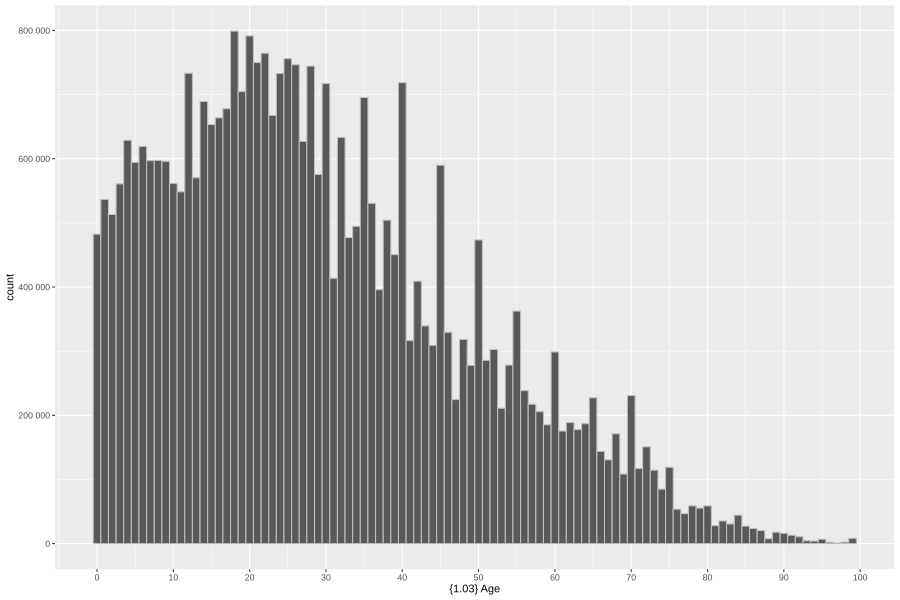

---
format:
  revealjs: default
---

```{r setup, include=FALSE}
library(tidyverse)

knitr::opts_chunk$set(
  echo = FALSE,
  warning = FALSE,
  message = FALSE,
  fig.width = 12,
  fig.height = 6.5,
  dpi = 150
)

BLUE <- "#1b91ff"
RED <- "#ff2c2d"
GRAY <- "#999999"
INK <- "#16314d"

theme_set(
  theme_minimal(base_size = 22) +
    theme(
      panel.grid.minor = element_blank(),
      plot.title = element_text(face = "bold", color = INK)
    )
)

# !Kung San adults (Howell): our running example
howell <- read_csv("datasets/kungsan.csv") |>
  select(-1) |>
  filter(age >= 18) |>
  mutate(
    sex = if_else(male == 1, "male", "female"),
    z_height = (height - mean(height)) / sd(height),
    z_weight = (weight - mean(weight)) / sd(weight)
  )

h_mean <- mean(howell$height)
h_sd <- sd(howell$height)
w_mean <- mean(howell$weight)
w_sd <- sd(howell$weight)
r_hw <- cor(howell$height, howell$weight)

# Ames, Iowa house sales 2006-2010 (De Cock 2011, via modeldata::ames)
houses <- read_csv("datasets/ames.csv")

fmt <- function(x, d = 1) formatC(x, format = "f", digits = d, big.mark = ",")
dollars <- function(x) {
  paste0("$", formatC(x, format = "f", digits = 0, big.mark = ","))
}
```


# Data Lunch: Week 2 {.center}

Talking about numbers differently


# Last week → this week

- Last week, our answer to "will the mayor win?" was not a number.
- It was a **distribution**: a whole curve of more and less plausible values.
- This week we learn to *read* and *talk about* distributions, and then use them to
  describe how two things move together.


# Goals this week

- Part 1: Concepts
  - Probability distributions: describing *how values vary*
  - Standardized values (z-scores): a common ruler
  - Correlation: how two variables move together
  - Regression: our first coefficient (one parameter only)
- Part 2: Applied
  - What makes a house expensive?


# Randomness has patterns

Problem: we want to understand how the admissions process works at a university. 

::: {.fragment .callout-note}
## Population: This isn't about one individual case but rather a group of cases
- "Applications to this university last year"
- "Applications to this university in the last ten years"
- "Applications to all state-run universities in this country last year"
:::

::: {.fragment .callout-tip}
## Variation: These cases are different from each other in ways that interest us
- "Exam results"
- "Family wealth"
- "Gender"
- "Department"
:::

::: {.fragment .callout-important}
## Randomness: Reality is messy, and we'll never predict admission perfectly. But, randomness has patterns. We can describe how it was generated.
- If I flip a coin 1 time, I can't say what will happen. 
- If I flip a coin 1000 times, I can say a lot more. 
- Random individuals → Predictable populations
:::


# Probability distributions: talking about numbers differently

::: {.fragment .callout-note .nonincremental}
- We talk about probability distributions all the time: "He's probably about 40, but he could be quite a bit older". 
- Here, we're just visualizing that kind of description over the range of all possible values.
:::

::: {.columns}

::: {.column width="30%"}
::: {.fragment}
<p style="font-size: 12pt;"><b>Uninformed</b> I have no idea. He could be between 0 and 100 and I don't think any possibility is more likely than any other.</p>
```{r, fig.width = 6, fig.height = 2.8}
curve(
  dunif(x, min = 0, max = 100),
  from = 0,
  to = 100,
  xlab = "Age",
  ylab = "Density",
  col = "red",
  lwd = 2
)
```

:::

::: {.fragment}
<p style="font-size: 12pt"><b>Weakly informed</b> He seems like he's about 40, but I could be very wrong about that. Anything between 20 and 60 seems plausible and even more extreme values are possible.</p>
```{r, fig.width = 6, fig.height = 2.8}
curve(
  dnorm(x, mean = 40, sd = 15),
  from = 0,
  to = 100,
  ylim = c(0, 0.1),
  xlab = "Age",
  ylab = "Density",
  col = "red",
  lwd = 2
)
```
:::
:::

::: {.column width="40%"}
::: {.fragment fragment-index=1}
{height="550px" style="text-align:center;"}
:::
:::

::: {.column width="30%"}
::: {.fragment }
<p style="font-size: 12pt"><b>Strongly informed</b> I'm quite certain that he's forty or relatively close to it.</p>
```{r, fig.width = 6, fig.height = 2.8}
curve(
  dnorm(x, mean = 40, sd = 1),
  from = 0,
  to = 100,
  xlab = "Age",
  ylab = "Density",
  col = "red",
  lwd = 2
)
```
:::

::: {.fragment}
<p style="font-size: 12pt"><b>Domain-specific distributions</b> I'm relatively certain he's between 30 and 50, but I have really no idea where in that range he lands. Older or younger than that seems unlikely, though.</p>

```{r, fig.width = 6, fig.height = 2.8}
# Steeper sides: shrink the taper width b
center <- 40
a <- 20 # plateau width (30 to 50)
b <- 15 # smaller = steeper sides

w <- function(x) {
  y <- numeric(length(x))

  L1 <- center - (a / 2 + b)
  L2 <- center - a / 2
  i <- x >= L1 & x < L2
  y[i] <- 0.5 * (1 - cos(pi * (x[i] - L1) / b))

  i <- x >= (center - a / 2) & x <= (center + a / 2)
  y[i] <- 1

  R1 <- center + a / 2
  R2 <- center + (a / 2 + b)
  i <- x > R1 & x <= R2
  y[i] <- 0.5 * (1 + cos(pi * (x[i] - R1) / b))

  y
}

A <- integrate(w, 0, 100)$value
curve(
  w(x) / A,
  from = 0,
  to = 100,
  ylim = c(0, 0.05),
  xlab = "Age",
  ylab = "Density",
  col = "red",
  lwd = 2
)
```

:::
:::

:::


# Two kinds of distributions

::: {.columns}
::: {.column}
::: {.callout-note .nonincremental}
## Distributions of data
How a quantity **varies across cases**.

- Heights of the adults in a village
- Prices of houses sold last year
- Ages of everyone in Nepal
:::
:::

::: {.column}
::: {.callout-tip .nonincremental}
## Distributions of belief
How **plausible** each value of a parameter is.

- The mayor's share of the vote
- The age of the man in the photo
- How much heavier taller people are
:::
:::
:::

::: {.fragment}
Same shapes, same vocabulary, same math. Today we start with the first kind and end
with the second.
:::


# A distribution of data: Nepal's population
<!-- TODO: Add NLSS age data. Why the bumps? -->
{width="80%" style="text-align:center;"}


# Our running example: the !Kung San

::: {.columns}
::: {.column width="45%"}
- Census data collected by anthropologist **Nancy Howell** in the late 1960s among
  the !Kung San of the Kalahari.
- `r nrow(howell)` adults (18+).
- Height (cm), weight (kg), age, sex.
- The same data McElreath uses in *Statistical Rethinking*.
:::

::: {.column width="55%"}
```{r howell-table}
howell |>
  select(height, weight, age, sex) |>
  head(6) |>
  knitr::kable(digits = 1)
```
:::
:::


# Describing a distribution

```{r height-hist}
ggplot(howell, aes(height)) +
  annotate(
    "rect",
    xmin = h_mean - h_sd,
    xmax = h_mean + h_sd,
    ymin = -Inf,
    ymax = Inf,
    fill = BLUE,
    alpha = 0.12
  ) +
  geom_histogram(binwidth = 2, fill = GRAY, color = "white") +
  geom_vline(
    xintercept = h_mean,
    color = RED,
    linewidth = 1.2,
    linetype = "dashed"
  ) +
  annotate(
    "text",
    x = h_mean,
    y = Inf,
    vjust = 1.5,
    hjust = -0.05,
    size = 7,
    color = RED,
    label = paste0("mean = ", fmt(h_mean), " cm")
  ) +
  annotate(
    "text",
    x = h_mean + h_sd,
    y = Inf,
    vjust = 4,
    hjust = -0.05,
    size = 7,
    color = BLUE,
    label = paste0("± 1 SD = ", fmt(h_sd), " cm")
  ) +
  labs(x = "Height (cm)", y = "Number of adults")
```

- [**Center**]{.red}: where is a typical value? (mean)
- [**Spread**]{.blue}: how far is a typical case from the center? (standard deviation)
- **Shape**: one hump or two? Symmetric, or a long tail?


# The Normal distribution

::: {.columns}
::: {.column width="60%"}
```{r normal-overlay}
ggplot(howell, aes(height)) +
  geom_histogram(
    aes(y = after_stat(density)),
    binwidth = 2,
    fill = GRAY,
    color = "white"
  ) +
  stat_function(
    fun = dnorm,
    args = list(mean = h_mean, sd = h_sd),
    color = BLUE,
    linewidth = 1.5
  ) +
  labs(x = "Height (cm)", y = "Density")
```
:::

::: {.column width="40%"}
- The blue curve is a Normal distribution with
  - mean = `r fmt(h_mean)`
  - SD = `r fmt(h_sd)`
- **Two numbers** describe the whole shape.
- Real data is never perfectly Normal, but many things are close.
:::
:::

::: {.fragment}
$$
\text{height} \sim \text{Normal}(\mu = `r fmt(h_mean)`,\ \sigma = `r fmt(h_sd)`)
$$
:::


# The 68–95–99.7 rule

```{r normal-rule}
bands <- tibble(
  k = c(3, 2, 1),
  fill = c("#d6ebff", "#8cc6ff", BLUE)
)

p <- ggplot() + xlim(-4, 4)
for (i in seq_len(nrow(bands))) {
  p <- p +
    stat_function(
      fun = dnorm,
      geom = "area",
      xlim = c(-bands$k[i], bands$k[i]),
      fill = bands$fill[i]
    )
}
p +
  stat_function(fun = dnorm, linewidth = 1.2, color = INK) +
  annotate(
    "text",
    x = 0,
    y = 0.18,
    label = "68%",
    size = 10,
    color = "white",
    fontface = "bold"
  ) +
  annotate("text", x = 1.5, y = 0.04, label = "95%", size = 8, color = INK) +
  annotate("text", x = 2.5, y = 0.015, label = "99.7%", size = 7, color = INK) +
  scale_x_continuous(
    breaks = -3:3,
    labels = c("-3 SD", "-2 SD", "-1 SD", "mean", "+1 SD", "+2 SD", "+3 SD")
  ) +
  labs(x = NULL, y = NULL) +
  theme(axis.text.y = element_blank())
```

- For a Normal distribution, about **68%** of cases fall within 1 SD of the mean,
  **95%** within 2 SD.
- Check: `r fmt(100 * mean(abs(howell$z_height) < 1), 0)`% of !Kung adults are within 1 SD
  of the average height, and `r fmt(100 * mean(abs(howell$z_height) < 2), 0)`% within 2 SD.


# Distributions Demo {.no-title}

```{shinylive-r}
#| standalone: true

``` 


# Standardized values (z-scores)

```{r z-example}
ex_h <- 165
ex_w <- 58
ex_zh <- (ex_h - h_mean) / h_sd
ex_zw <- (ex_w - w_mean) / w_sd
```

A !Kung man is **`r ex_h` cm** tall and weighs **`r ex_w` kg**.
Is he more unusually *tall* or more unusually *heavy*?

- We can't compare centimeters to kilograms.
- But we can ask of each: **how many standard deviations from average is this?**

::: {.fragment}
$$
z = \frac{x - \text{mean}}{\text{SD}}
$$
:::

::: {.fragment .nonincremental}
- Height: (`r ex_h` − `r fmt(h_mean)`) / `r fmt(h_sd)` = [**`r fmt(ex_zh, 2)`**]{.blue}
- Weight: (`r ex_w` − `r fmt(w_mean)`) / `r fmt(w_sd)` = [**`r fmt(ex_zw, 2)`**]{.red}
- He is more unusually heavy than he is tall.
:::


## Same data, new ruler

::: {.columns}
::: {.column}
```{r hist-cm, fig.width = 7, fig.height = 5}
# Bins anchored at the mean and a shared x-range, so each bar holds the same
# people in both plots
z_range <- c(-3, 3.5)

ggplot(howell, aes(height)) +
  geom_histogram(
    binwidth = 2,
    boundary = h_mean,
    fill = GRAY,
    color = "white"
  ) +
  geom_vline(
    xintercept = h_mean,
    color = RED,
    linewidth = 1.2,
    linetype = "dashed"
  ) +
  coord_cartesian(xlim = h_mean + z_range * h_sd) +
  labs(x = "Height (cm)", y = NULL)
```
:::

::: {.column}
```{r hist-z, fig.width = 7, fig.height = 5}
ggplot(howell, aes(z_height)) +
  geom_histogram(
    binwidth = 2 / h_sd,
    boundary = 0,
    fill = BLUE,
    color = "white"
  ) +
  geom_vline(
    xintercept = 0,
    color = RED,
    linewidth = 1.2,
    linetype = "dashed"
  ) +
  scale_x_continuous(breaks = -3:3) +
  coord_cartesian(xlim = z_range) +
  labs(x = "Height (z-score, in SDs)", y = NULL)
```
:::
:::

- The **shape** doesn't change at all. Only the labels on the axis.
- The mean becomes **0**. The standard deviation becomes **1**.
- The units disappear: a z-score is measured in "standard deviations".


## Reading z-scores

::: {.columns}
::: {.column width="45%"}
| z      | Meaning                          |
|--------|----------------------------------|
| 0      | exactly average                  |
| ±1     | ordinary                         |
| ±2     | unusual (about 1 in 20)          |
| ±3     | rare (about 1 in 370)            |
: {.nonincremental}
:::

::: {.column width="55%"}
In R:

```{r z-code, echo = TRUE, eval = FALSE}
howell |>
  mutate(
    z_height = (height - mean(height)) / sd(height),
    z_weight = (weight - mean(weight)) / sd(weight)
  )
```
:::
:::

- z-scores let us compare things measured on completely different scales:
  exam marks out of 50 vs. out of 100, rupees vs. dollars, cm vs. kg.


# Correlation

```{r scatter-raw}
ggplot(howell, aes(height, weight)) +
  geom_point(color = BLUE, alpha = 0.6, size = 2.5) +
  labs(x = "Height (cm)", y = "Weight (kg)")
```

- Taller people tend to be heavier. But **how strongly** do they go together?


## Standardize both variables

```{r scatter-z}
quad_labels <- tibble(
  x = c(1.9, -1.9, -1.9, 1.9),
  y = c(2.8, -2.8, 2.8, -2.8),
  label = c(
    "taller & heavier  (+)",
    "shorter & lighter  (+)",
    "shorter & heavier  (−)",
    "taller & lighter  (−)"
  ),
  color = c(BLUE, BLUE, RED, RED)
)

howell |>
  mutate(agree = if_else(z_height * z_weight > 0, "agree", "disagree")) |>
  ggplot(aes(z_height, z_weight)) +
  geom_hline(yintercept = 0, color = GRAY) +
  geom_vline(xintercept = 0, color = GRAY) +
  geom_point(aes(color = agree), alpha = 0.7, size = 2.5, show.legend = FALSE) +
  geom_text(
    data = quad_labels,
    aes(x, y, label = label),
    color = quad_labels$color,
    size = 7,
    fontface = "bold"
  ) +
  scale_color_manual(values = c(agree = BLUE, disagree = RED)) +
  coord_equal(xlim = c(-3.5, 3.5), ylim = c(-3, 3)) +
  labs(x = "Height (z)", y = "Weight (z)")
```


## Correlation is average agreement

::: {.columns}
::: {.column width="55%"}
$$
r = \frac{1}{n-1} \sum_{i=1}^{n} z_{\text{height},i} \times z_{\text{weight},i}
$$

- Each person "votes":
  - [Same side of average on both → **positive** vote]{.blue}
  - [Opposite sides → **negative** vote]{.red}
- *r* is the average vote.
:::

::: {.column width="45%"}
::: {.fragment}
```{r cor-code, echo = TRUE}
cor(howell$height, howell$weight)
```
:::

- *r* is always between **−1** and **+1**.
- *r* has no units.
- Standardizing changes nothing: *r* in cm/kg = *r* in z-scores.
:::
:::


## What does *r* look like?

```{r cor-gallery, fig.height = 3.6}
set.seed(2)
rs <- c(-0.8, -0.3, 0, 0.3, 0.6, 0.9)
gallery <- map_dfr(rs, function(r) {
  x <- rnorm(150)
  tibble(r = r, x = x, y = r * x + sqrt(1 - r^2) * rnorm(150))
}) |>
  mutate(panel = factor(paste0("r = ", r), levels = paste0("r = ", rs)))

ggplot(gallery, aes(x, y)) +
  geom_point(color = BLUE, alpha = 0.6, size = 1.8) +
  facet_wrap(~panel, nrow = 1) +
  coord_equal() +
  labs(x = NULL, y = NULL) +
  theme(
    axis.text = element_blank(),
    strip.text = element_text(size = 22, face = "bold")
  )
```

- Our height and weight: *r* = `r fmt(r_hw, 2)`. A strong relationship, but far from perfect.


## What correlation misses

```{r cor-misses, fig.height = 5.5}
set.seed(4)
x1 <- runif(150, -3, 3)
x2 <- rnorm(30)
x3a <- rnorm(75, -1.5, 0.5)
x3b <- rnorm(75, 1.5, 0.5)

misses <- bind_rows(
  tibble(panel = "A curve", x = x1, y = x1^2 + rnorm(150, 0, 0.8)),
  tibble(panel = "One extreme point", x = c(x2, 8), y = c(rnorm(30), 8)),
  tibble(
    panel = "Two groups",
    x = c(x3a, x3b),
    y = c(
      -0.8 * x3a - 2 + rnorm(75, 0, 0.4),
      -0.8 * x3b + 2 + rnorm(75, 0, 0.4)
    )
  )
) |>
  group_by(panel) |>
  mutate(panel = paste0(panel, ":  r = ", fmt(cor(x, y), 2))) |>
  ungroup()

ggplot(misses, aes(x, y)) +
  geom_point(color = BLUE, alpha = 0.6, size = 2) +
  facet_wrap(~panel, scales = "free") +
  labs(x = NULL, y = NULL) +
  theme(
    axis.text = element_blank(),
    strip.text = element_text(size = 20, face = "bold")
  )
```

- *r* only measures **straight-line** agreement.
- **Always plot your data** before trusting a single number.


# Regression: our first coefficient

::: {.columns}
::: {.column width="55%"}
```{r candidate-lines, fig.width = 7, fig.height = 6.5}
candidates <- tibble(
  beta = c(0, 0.4, round(r_hw, 2), 1.5),
  label = paste0("β = ", beta)
)

ggplot(howell, aes(z_height, z_weight)) +
  geom_point(color = GRAY, alpha = 0.6, size = 2) +
  geom_abline(
    data = candidates,
    aes(slope = beta, intercept = 0, color = label),
    linewidth = 1.4
  ) +
  scale_color_manual(values = c("#e69f00", "#009e73", BLUE, RED), name = NULL) +
  coord_equal(xlim = c(-3, 3), ylim = c(-3, 3)) +
  labs(x = "Height (z)", y = "Weight (z)") +
  theme(legend.position = "top", legend.text = element_text(size = 20))
```
:::

::: {.column width="45%"}
In z-space, both variables have mean 0, so a line through the middle of the cloud
needs only **one parameter**: its slope, β.

$$
z_{\text{weight}} = \beta \times z_{\text{height}}
$$

- Which line describes the data best?
:::
:::


## The best line

::: {.columns}
::: {.column width="55%"}
```{r residuals, fig.width = 7, fig.height = 6.5}
howell |>
  mutate(fitted = r_hw * z_height) |>
  ggplot(aes(z_height, z_weight)) +
  geom_segment(aes(xend = z_height, yend = fitted), color = RED, alpha = 0.4) +
  geom_point(color = GRAY, size = 2) +
  geom_abline(slope = r_hw, intercept = 0, color = BLUE, linewidth = 1.5) +
  coord_equal(xlim = c(-3, 3), ylim = c(-3, 3)) +
  labs(x = "Height (z)", y = "Weight (z)")
```
:::

::: {.column width="45%"}
- The [red lines]{.red} are the **errors**: how far each person is from the line.
- The best line makes the errors as small as possible overall.
- With standardized data and one predictor, the best β is exactly the correlation:
  **β = r = `r fmt(r_hw, 2)`**.
:::
:::


## Reading the coefficient

```{r slope-units}
slope_kg_cm <- r_hw * w_sd / h_sd
```

::: {.columns}
::: {.column width="45%"}
- In z-scores: **β = `r fmt(r_hw, 2)`**
  - "An adult 1 SD taller than average is, on average, `r fmt(r_hw, 2)` SD heavier."
- Back in real units: β × SD~weight~ / SD~height~
  - `r fmt(r_hw, 2)` × `r fmt(w_sd)` / `r fmt(h_sd)` = **`r fmt(slope_kg_cm, 2)` kg per cm**
  - "Each extra centimeter of height goes with about `r fmt(slope_kg_cm, 2)` kg more
    weight."
:::

::: {.column width="55%"}
```{r slope-plot, fig.width = 7, fig.height = 5.5}
ggplot(howell, aes(height, weight)) +
  geom_point(color = GRAY, alpha = 0.6, size = 2) +
  geom_smooth(method = "lm", se = FALSE, color = BLUE, linewidth = 1.5) +
  labs(x = "Height (cm)", y = "Weight (kg)")
```

```{r lm-code, echo = TRUE}
coef(lm(weight ~ height, data = howell))
```
:::
:::


## β is a parameter, so it has a distribution

```{r beta-posterior}
# Grid approximation over (beta, sigma), then sum out sigma
beta_posterior <- function(d) {
  grid <- expand_grid(
    beta = seq(0, 1.5, length.out = 301),
    sigma = seq(0.2, 1.5, length.out = 131)
  ) |>
    mutate(
      log_post = map2_dbl(beta, sigma, function(b, s) {
        sum(dnorm(d$z_weight, b * d$z_height, s, log = TRUE))
      }) +
        dnorm(beta, 0, 1, log = TRUE) +
        dexp(sigma, 1, log = TRUE),
      post = exp(log_post - max(log_post))
    )
  grid |>
    group_by(beta) |>
    summarise(post = sum(post)) |>
    mutate(post = post / sum(post) / (beta[2] - beta[1]))
}

set.seed(7)
small <- slice_sample(howell, n = 20)

bind_rows(
  beta_posterior(small) |> mutate(data = "20 adults"),
  beta_posterior(howell) |> mutate(data = paste(nrow(howell), "adults"))
) |>
  ggplot(aes(beta, post, color = data)) +
  geom_line(linewidth = 1.5) +
  scale_color_manual(values = c(RED, BLUE), name = NULL) +
  labs(x = "β (SD of weight per SD of height)", y = "Plausibility") +
  theme(legend.position = "top", axis.text.y = element_blank())
```

::: {.nonincremental}
- Just like the mayor's popularity last week: **prior × likelihood → posterior**.
- With 20 people we're unsure about β. With `r nrow(howell)`, much less so.
:::


# Part 1: Summary

- **Distributions**: describe numbers by their *center*, *spread*, and *shape*, not
  just a single value.
- **z-scores**: how many SDs from the average. One ruler for everything.
- **Correlation** (*r*): the average agreement of two z-scores, from −1 to +1.
- **Regression coefficient** (β): the slope of the best line. With standardized data
  and one predictor, β = *r*.
- β is a **parameter**: we can have a prior and a posterior distribution for it.


# Part 2: What makes a house expensive? {.center}


## The data: house sales in Ames, Iowa

- `r fmt(nrow(houses), 0)` houses sold 2006–2010 in Ames, a US college town
  (De Cock, 2011). Prices in US dollars; areas converted to m².

```{r houses-table}
houses |>
  select(price, area_m2, year_built, bedrooms, bathrooms, garage_cars) |>
  head(6) |>
  mutate(price = dollars(price)) |>
  knitr::kable(align = "r")
```


## Step 1: Look at the distribution

```{r price-hist, fig.height = 5.5}
p_mean <- mean(houses$price)
p_median <- median(houses$price)

ggplot(houses, aes(price)) +
  geom_histogram(binwidth = 10000, fill = GRAY, color = "white") +
  geom_vline(
    xintercept = p_median,
    color = BLUE,
    linewidth = 1.2,
    linetype = "dashed"
  ) +
  geom_vline(
    xintercept = p_mean,
    color = RED,
    linewidth = 1.2,
    linetype = "dashed"
  ) +
  annotate(
    "text",
    x = p_mean,
    y = Inf,
    vjust = 1.5,
    hjust = -0.05,
    size = 7,
    color = RED,
    label = paste("mean =", dollars(p_mean))
  ) +
  annotate(
    "text",
    x = p_median,
    y = Inf,
    vjust = 3.5,
    hjust = -0.05,
    size = 7,
    color = BLUE,
    label = paste("median =", dollars(p_median))
  ) +
  scale_x_continuous(labels = scales::label_dollar()) +
  labs(x = "Sale price", y = "Number of houses")
```

- Not Normal: a **long right tail** of a few very expensive houses.
- The tail pulls the [mean]{.red} above the [median]{.blue}. Which is the "typical" price?


## Step 2: How unusual is this house?

```{r unusual-houses}
houses <- houses |>
  mutate(
    z_price = (price - mean(price)) / sd(price),
    z_area = (area_m2 - mean(area_m2)) / sd(area_m2)
  )

unusual <- bind_rows(
  houses |> slice_max(price, n = 1) |> mutate(house = "A: most expensive"),
  houses |> slice_max(area_m2, n = 1) |> mutate(house = "B: largest")
)
```

::: {.columns}
::: {.column width="45%"}
| | Mean | SD |
|-|------|----|
| Price | `r dollars(mean(houses$price))` | `r dollars(sd(houses$price))` |
| Living area | `r fmt(mean(houses$area_m2))` m² | `r fmt(sd(houses$area_m2))` m² |
: {.nonincremental}
:::

::: {.column width="55%"}
```{r unusual-table}
unusual |>
  transmute(house, price = dollars(price), `area (m²)` = area_m2) |>
  knitr::kable(align = "lrr")
```
:::
:::

**Your turn:** compute the z-scores for houses A and B. Which one is more unusual, and
in what way?

::: {.fragment}
```{r unusual-z}
unusual |>
  transmute(
    house,
    `z (price)` = fmt(z_price, 1),
    `z (area)` = fmt(z_area, 1)
  ) |>
  knitr::kable(align = "lrr")
```
:::


## Step 3: Price and living area

```{r price-area, fig.height = 6}
r_pa <- cor(houses$price, houses$area_m2)

ggplot(houses, aes(area_m2, price)) +
  geom_point(color = BLUE, alpha = 0.3, size = 1.8) +
  geom_point(data = unusual, color = RED, size = 5) +
  geom_text(
    data = unusual,
    aes(label = str_sub(house, 1, 1)),
    color = RED,
    size = 8,
    fontface = "bold",
    nudge_x = -25
  ) +
  scale_y_continuous(labels = scales::label_dollar()) +
  labs(x = "Living area (m²)", y = "Sale price")
```

- *r* = `r fmt(r_pa, 2)`. Bigger houses sell for more, but with lots of scatter.
- House B is far off the pattern. What might be going on?


## Step 4: Guess first

Before we look: **rank these from strongest to weakest correlation with price.**

::: {.nonincremental}
- Number of bedrooms
- Number of bathrooms
- Living area
- Lot (land) area
- Garage size (cars)
- Year built
:::


## Step 4: The correlations

```{r cor-bars, fig.height = 6}
features <- c(
  area_m2 = "Living area",
  garage_cars = "Garage size",
  year_built = "Year built",
  bathrooms = "Bathrooms",
  lot_m2 = "Lot area",
  bedrooms = "Bedrooms"
)

houses |>
  summarise(across(all_of(names(features)), ~ cor(.x, price))) |>
  pivot_longer(everything(), names_to = "feature", values_to = "r") |>
  mutate(feature = fct_reorder(features[feature], r)) |>
  ggplot(aes(r, feature)) +
  geom_col(fill = BLUE, width = 0.7) +
  geom_text(aes(label = fmt(r, 2)), hjust = -0.2, size = 8) +
  scale_x_continuous(limits = c(0, 1)) +
  labs(x = "Correlation with sale price (r)", y = NULL)
```

- Because *r* has no units, we can compare m², cars, years, and rooms on one scale.


## Step 5: One coefficient

```{r price-slope}
slope_usd_m2 <- r_pa * sd(houses$price) / sd(houses$area_m2)
```

::: {.columns}
::: {.column width="55%"}
$$
z_{\text{price}} = \beta \times z_{\text{area}}
$$

- In z-scores: **β = `r fmt(r_pa, 2)`**
  - "A house 1 SD larger than average sells, on average, for `r fmt(r_pa, 2)` SD more."
- In real units: `r fmt(r_pa, 2)` × `r dollars(sd(houses$price))` /
  `r fmt(sd(houses$area_m2))` m² ≈ **`r dollars(slope_usd_m2)` per m²**
  - "Each extra square meter of living space goes with about
    `r dollars(slope_usd_m2)` more in price."
:::

::: {.column width="45%"}
```{r price-z, fig.width = 6, fig.height = 6}
ggplot(houses, aes(z_area, z_price)) +
  geom_point(color = GRAY, alpha = 0.3, size = 1.5) +
  geom_abline(slope = r_pa, intercept = 0, color = BLUE, linewidth = 1.5) +
  coord_equal() +
  labs(x = "Living area (z)", y = "Price (z)")
```
:::
:::


## A puzzle: bedrooms

```{r bedrooms-puzzle, fig.height = 5.5}
size_breaks <- quantile(houses$area_m2, c(0, 1 / 3, 2 / 3, 1))
size_labels <- c(
  paste0("Small (< ", fmt(size_breaks[2], 0), " m²)"),
  paste0(
    "Medium (",
    fmt(size_breaks[2], 0),
    "–",
    fmt(size_breaks[3], 0),
    " m²)"
  ),
  paste0("Large (> ", fmt(size_breaks[3], 0), " m²)")
)

houses |>
  mutate(
    size = cut(
      area_m2,
      size_breaks,
      labels = size_labels,
      include.lowest = TRUE
    )
  ) |>
  group_by(size, bedrooms) |>
  filter(n() >= 20) |>
  summarise(price = median(price), .groups = "drop") |>
  ggplot(aes(bedrooms, price)) +
  geom_line(color = BLUE, linewidth = 1.5) +
  geom_point(color = BLUE, size = 4) +
  facet_wrap(~size) +
  scale_y_continuous(labels = scales::label_dollar()) +
  labs(x = "Bedrooms", y = "Median sale price") +
  theme(strip.text = element_text(size = 20, face = "bold"))
```

- Overall, more bedrooms go with a *higher* price (*r* = `r fmt(cor(houses$bedrooms, houses$price), 2)`).
- But among medium and large houses of **similar size**, more bedrooms go with a
  *lower* price.
- How can both be true?


# Next week

- Correlation and regression describe **how** things move together.
- They don't tell us **why**.
- To answer "does adding a bedroom make a house more valuable?", we need to say what
  we think causes what.
- Next week: **DAGs** and **causal models**.
